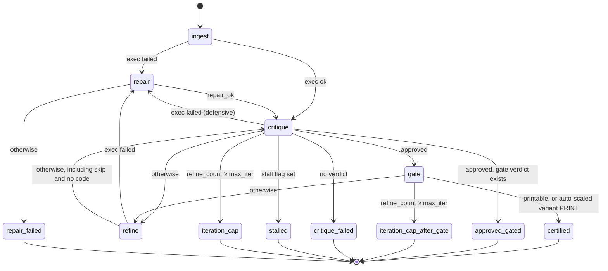

# The agentic design loop (`abcad.agent`)

The design loop turns a sentence of text into a certified, single-material print file. Given a
prompt such as "a woven cubic lattice metamaterial", it writes a Blender Python script with a
fine-tuned code emitter, builds and renders the geometry in headless Blender, has a local
vision-language critic judge the render against retrieved reference renders, repairs scripts that
fail, refines designs the critic rejects, and gates the first approved design for printability
with the quantitative print audit of [PRINTING.md](PRINTING.md), auto-scaling the part when its
features are too thin. Every run that creates a run folder ends with a machine-readable manifest,
whatever the outcome.

Everything runs on one Apple-silicon machine with 16 GB of unified memory and no cloud service:
the code emitter in PyTorch, the critic and the repair and refine model in a local Ollama daemon,
geometry in Blender, and the print audit in Python. The controlled operating procedure is
[ABCAD-SOP-001](qms/ABCAD-SOP-001_loop_operation.pdf), the loop convergence run (test method TM-4)
and its acceptance criteria are defined in
[ABCAD-QMS-002](qms/ABCAD-QMS-002_definitions_and_tests.pdf), and measured timings and memory
peaks are in [PERF.md](PERF.md).

```text
prompt
  Phase 1   child process, exits    code exemplars -> LoRA code emitter -> Blender script
  Phase 2   parent process          ingest     headless Blender: build, render, MESH_STATS, STL
                                    critique   vision critic against retrieved reference renders
                                    repair     when a script fails to execute
                                    refine     when the critic rejects a design
                                    gate       light check, deep print audit, auto-scale (once)
                                    -> run_manifest.json on every terminal path
```

---

## 1. Phases and memory model

A single process cannot hold the PyTorch code emitter and also drive the Ollama models and
Blender within 16 GB: even after the adapter weights are released, the PyTorch/Metal runtime keeps
gigabytes resident, and exiting the process is the only reliable way to return that memory to the
operating system. The loop therefore runs in two phases that never overlap
([`phase_one.py`](../abcad/agent/phase_one.py), [`runner.py`](../abcad/agent/runner.py)). The
emitter needs about 8–9 GB, and the two Ollama models 4.7 GB (repair and refine) and 6.1 GB
(critic) ([PERF.md §3](PERF.md#3-agentic-loop)); the split, together with the daemon settings of
§12, keeps any two of them from being resident at the same time.

| Phase | Process | Holds | Does |
|---|---|---|---|
| 1. Code emitter | A child, `python -m abcad.agent --emit-code <hand-off file> <prompt>`, in its own process group | The tokenizer, the base model and the LoRA adapter (an unmerged PEFT wrapper), by default on `mps`, else `cuda:0`, else `cpu`, in float16; an embedder and the code-exemplar index | Retrieves exemplars, emits one script, writes it atomically to the hand-off file, releases the model, and exits (status 0, or 1 on any exception) |
| 2. Render, critique, repair | The parent: the command you ran | No emitter or chat-model weights; its only model is the small embedder on the CPU, shared by both retrieval indexes. With the daemon settings of §12, Ollama keeps one model loaded at a time | Runs the state machine (§3) and writes the manifest (§10) |

The parent drives Phase 1 in this order:

0. Ask a local Ollama daemon to unload every model it holds (`GET /api/ps`, then a request with
   `keep_alive: 0` per model; best effort, skipped quietly for any other server). A model left
   resident by an earlier run's keep-alive would otherwise share unified memory with the emitter.
1. Delete the hand-off file (`$ABCAD_OUT/agent_tmp/generated_code.py`) if an earlier run left
   one, so stale output can never pass for fresh output.
2. Start the child with the parent's environment, the parent's settings rendered back into
   `ABCAD_*` variables (so the child sees exactly the parent's configuration), and
   `PYTHONUNBUFFERED=1`.
3. Forward each line of the child's merged stdout and stderr into the log with a `[phase1]`
   prefix, so the emit is recorded in `run.log`.
4. Wait up to `ABCAD_EMIT_TIMEOUT_S` (1800 s). A timeout kills the child's whole process group
   and ends the run `emit_failed` (detail `timeout`); a non-zero exit ends it `emit_failed`
   (detail `exit <code>`); a missing or blank hand-off file ends it `emit_empty`. The child runs in
   its own session, so no signal to the parent's process group reaches it: while the parent waits,
   SIGTERM and SIGHUP end the parent with status 128 + signal, and any abnormal end of the wait
   (including Ctrl-C) kills the child's process group first, so no emitter is ever orphaned.
5. Only then build the Phase-2 components: the embedder, both retrieval indexes, the chat
   endpoint, the Blender executor, the critic and the gate.

Before exiting, the child drops its model references, collects garbage and empties the MPS cache,
but the exit is the authoritative release. Importing `abcad.agent` loads nothing heavy (the public
names resolve lazily), and the emitter imports torch, transformers and peft inside its load
function, which only the child calls. With `--use-code` Phase 1 is skipped entirely.

### 1.1 The code emitter

The adapter was fine-tuned on one chat frame and one request template, and its output depends on
them, so [`emitter.py`](../abcad/agent/emitter.py) reproduces both exactly. The base model's
built-in chat template is not used, because it injects a date preamble the adapter never saw;
the header tokens are written as literal text instead (each blank line below is the pair of line
feeds that follows a header):

```text
<|begin_of_text|><|start_header_id|>system<|end_header_id|>

You are a helpful assistant<|eot_id|><|start_header_id|>user<|end_header_id|>

<user text><|eot_id|><|start_header_id|>assistant<|end_header_id|>

```

The user text, around the retrieved context block of §7 (empty when retrieval is off; the
surrounding text stays the same):

```text
You are a Blender scripting assistant.

Here are some useful base codes retrieved from the database:

<context block>

User request: Write Blender Python code for a <prompt>.

Generate ONLY valid Blender Python code.
```

- **Modes.** In the default `design` mode the request line is as shown; in `direct` mode it is
  `User request: <prompt>`, with no period added (`ABCAD_EMIT_MODE`).
- **Verbatim framing.** The frame is tokenized with the tokenizer's default special-token
  handling, so the tokenizer's own beginning-of-text token precedes the literal one, and a prompt
  that starts with "a" reads "for a a …". Both are part of the input distribution the adapter was
  trained on and are kept.
- **Generation.** Sampling at temperature 0.1 and top-p 0.9, at most 2048 new tokens, stopping at
  the base model's end-of-sequence tokens. Emits are stochastic unless `ABCAD_EMIT_SEED` is set,
  which seeds Python's `random` and torch on every device.
- **Decoding.** Only the newly generated tokens are decoded (special tokens skipped), so exemplar
  code from the prompt can never leak into the script. The completion is then extracted and
  normalized (§1.2); `--smoke` prints its first 1200 characters.

### 1.2 Script extraction and normalization

[`scripttext.py`](../abcad/agent/scripttext.py) decides, with deterministic string rules, which
code the emitter, the repair step and the refine step accept:

- **Extraction** from a model reply, first rule that applies: the content of the last fenced block
  whose opening fence is three backticks followed directly by `python`; otherwise everything from
  the last `import bpy` to the end; otherwise the whole reply. The result is stripped.
- **Normalization**, applied before every execution: an empty script becomes `import bpy`;
  surrounding whitespace is stripped; every `python`-tagged fence marker and every remaining
  triple backtick is removed; control characters other than tab and line feed are removed (so
  CRLF becomes LF); and `import bpy` is prepended when the script does not start with it.
- **Digest**: the SHA-1 of the stripped script, a content fingerprint that the stall guards
  compare to detect verbatim repeats (§5).

A `--use-code` script is read as UTF-8 and normalized, but not extracted.

## 2. Module map

| Module | Responsibility |
|---|---|
| [`__init__.py`](../abcad/agent/__init__.py) | Public API, resolved lazily: `AgentSettings`, `load_settings`, `DesignLoop`, `run_design_loop`, `LoopOutcome` |
| [`__main__.py`](../abcad/agent/__main__.py) | `python -m abcad.agent`; also the entry point of the Phase-1 child |
| [`cli.py`](../abcad/agent/cli.py) | Argument parsing, the four modes, exit codes |
| [`settings.py`](../abcad/agent/settings.py) | `AgentSettings`: every setting, `ABCAD_*` loading and validation, derived paths, the manifest snapshot, the settings hand-off to the child |
| [`console.py`](../abcad/agent/console.py) | Logging to stdout, the `run.log` tee, structured event lines |
| [`phase_one.py`](../abcad/agent/phase_one.py) | Phase-1 isolation: the child launcher (parent side) and the emit worker (child side) |
| [`emitter.py`](../abcad/agent/emitter.py) | The LoRA code emitter: loading, the exact prompt frame, generation, unloading |
| [`retrieval.py`](../abcad/agent/retrieval.py) | The embedder, the code-exemplar index, the reference-render gallery, the context-block format |
| [`scripttext.py`](../abcad/agent/scripttext.py) | Script extraction, normalization and digests |
| [`chat.py`](../abcad/agent/chat.py) | Client for the local chat endpoint: text and vision calls, retries, the loopback guard |
| [`blender.py`](../abcad/agent/blender.py) | `BlenderExecutor`: job file, process-group execution with a timeout, stdout protocol, execution report |
| [`blender_harness.py`](../abcad/agent/blender_harness.py) | The script Blender runs: executes the candidate, sets up the studio, reports `MESH_STATS`, renders, exports the STL |
| [`ingest.py`](../abcad/agent/ingest.py) | Step `ingest`: executes the entry script once |
| [`critic.py`](../abcad/agent/critic.py) | The render critic, the verdict schema and parser, step `critique` |
| [`repair.py`](../abcad/agent/repair.py) | Step `repair`, with its stall guards |
| [`refine.py`](../abcad/agent/refine.py) | Step `refine` |
| [`gate.py`](../abcad/agent/gate.py) | Step `gate`: deep-audit preflight, target-size bridge, gate view, certification summary |
| [`manufacturability.py`](../abcad/agent/manufacturability.py) | The gate itself: light check, deep audit, auto-scale, the refine-or-end rule |
| [`routing.py`](../abcad/agent/routing.py) | Pure routers and the terminal-reason vocabulary |
| [`loop_state.py`](../abcad/agent/loop_state.py) | The loop-state fields, the initial state, the update merge |
| [`runner.py`](../abcad/agent/runner.py) | `DesignLoop` (the state-machine executor), preflight, Phase-2 construction, `run_design_loop` |
| [`manifest.py`](../abcad/agent/manifest.py) | Building and atomically writing `run_manifest.json` |

Two import rules keep the phases apart. Importing `abcad.agent`, or any module the Phase-2 parent
needs, loads no emitter; the heavy imports of the emitter, the embedder, Pillow and the deep audit
happen on first use only. And `blender_harness.py` imports nothing from `abcad`, because it runs
inside Blender's embedded Python; it imports `bpy` and `mathutils` inside its entry point only, so
its placement and statistics formulas are unit-tested without Blender.

## 3. State machine

[`runner.py`](../abcad/agent/runner.py) executes the loop as an explicit state machine, without a
graph framework. Five steps share one flat, JSON-serializable state
([`loop_state.py`](../abcad/agent/loop_state.py)): each step receives a read-only copy and returns
an update holding only the fields it changed, which the runner merges (a field name the state
does not define is an error). The routers of [`routing.py`](../abcad/agent/routing.py) are pure
functions of the merged state: they choose the next step and never write, so every field the
manifest reports is maintained by a step.

### 3.1 Steps and the runner

| Step | What it does | Execution label |
|---|---|---|
| `ingest` (entry) | Executes the normalized entry script (the Phase-1 emit or the `--use-code` file) once and sets `approved` to false | `initial` |
| `critique` | Judges the latest successful render against retrieved reference renders (§4) | none |
| `repair` | Up to `ABCAD_REPAIR_ATTEMPTS` stall-guarded attempts to make the failing script execute (§5.1) | `fix_run_<n>`, numbered run-wide |
| `refine` | One parameter-level edit in response to the critique, executed once (§5.2) | `design_iter_<k>`, k = `refine_count` |
| `gate` | Single-material manufacturability verdict, deep print audit and auto-scale (§8) | none |

For each step the runner checks the step limit (`ABCAD_STEP_LIMIT`; reaching it ends the run
`step_limit`), calls the step, merges its update together with `last_step` and
`steps_taken + 1`, asks the step's router for a decision, and appends `{"step", "next", "reason"}`
to `trace`. An exception in a step or a router is logged with its traceback and ends the run
`error`, with the detail `<ExceptionType>: <message>`. Every termination records
`terminal_reason` and writes the manifest.

### 3.2 Router decision tables

Rows are evaluated from top to bottom and the first match wins; `max_iter` is `ABCAD_MAX_ITER`.

**After `ingest`.** A failed initial execution has no render, so no critic call is spent on it.

| # | Condition | Next |
|---|---|---|
| 1 | `exec_status` is not `"success"` | `repair` |
| 2 | otherwise | `critique` |

**After `repair`.**

| # | Condition | Next |
|---|---|---|
| 1 | `repair_ok` is true | `critique` |
| 2 | otherwise | END `repair_failed` |

**After `refine`.** Row 2 also covers visits that executed nothing (a skip, or a reply without
code): their `exec_status` is still the previous `"success"`, so the same render is critiqued
again.

| # | Condition | Next |
|---|---|---|
| 1 | `exec_status` is not `"success"` | `repair` |
| 2 | otherwise | `critique` |

**After `critique`.**

| # | Condition | Next |
|---|---|---|
| 1 | `approved`, and a gate verdict (`manufacturability`) exists | END `approved_gated` |
| 2 | `approved` | `gate` |
| 3 | `exec_status` is not `"success"` | `repair` (defensive; the critic only runs after a successful execution) |
| 4 | `critique_failed` | END `critique_failed` |
| 5 | `stalled` | END `stalled` |
| 6 | `refine_count` ≥ `max_iter` | END `iteration_cap` |
| 7 | otherwise | `refine` |

**After `gate`.**

| # | Condition | Next |
|---|---|---|
| 1 | `manufacturability.printable` is true | END `certified` |
| 2 | `manufacturability.deep_audit.autoscaled_variant.verdict` is `"PRINT"` (any level may be absent) | END `certified` |
| 3 | The gate module's `route_after_manufacturability` returns `"end"` for `manufacturable` and `iteration_count` = `refine_count`; after rows 1 and 2 this means `refine_count` ≥ `max_iter` | END `iteration_cap_after_gate` |
| 4 | otherwise | `refine` |



The diagram shows the edges of the tables without their evaluation order; the tables are
authoritative. The runner's own ends (`step_limit`, `error`) and the Phase-1 ends (`emit_failed`,
`emit_empty`) are not router decisions and are not drawn.

### 3.3 Caps and counters

| Cap | Default | Counted | Effect |
|---|---|---|---|
| Refine visits, `ABCAD_MAX_ITER` | 3 per run | `refine_count`, incremented at the start of every refine visit, including skips and visits that return no code | Critique row 6 and gate row 3 |
| Repair attempts, `ABCAD_REPAIR_ATTEMPTS` | 3 per visit | Inside a visit; a reply without code, a chat error and a verbatim repeat each consume an attempt | The visit ends on success, when the budget is spent, or on a repeat at the last temperature rung |
| Critique attempts, `ABCAD_CRITIQUE_ATTEMPTS` | 2 per visit | Inside the critique step | Then `critique_failed` |
| Step limit, `ABCAD_STEP_LIMIT` | 25 per run | `steps_taken` | Safety net: `step_limit` |
| Blender timeout, `ABCAD_BLENDER_TIMEOUT_S` | 300 s per execution | Executor | A failed execution |
| Chat timeout and retries, `ABCAD_LLM_TIMEOUT_S`, `ABCAD_LLM_MAX_RETRIES` | 600 s per request, 2 retries | Chat endpoint | A chat error (§9) |
| Phase-1 timeout, `ABCAD_EMIT_TIMEOUT_S` | 1800 s | Parent | `emit_failed` |

The longest path the routers allow is 4 + 3 × max_iter steps: ingest, repair and critique, then
refine, repair and critique for each refine visit, plus the single gate visit. At the default
that is 13 steps, well inside the step limit of 25; raise `ABCAD_STEP_LIMIT` as well if you raise
`ABCAD_MAX_ITER` above 7.

### 3.4 Terminal reasons and exit codes

| `terminal_reason` | Produced by | Meaning | `approved` at the end | Exit |
|---|---|---|---|---|
| `certified` | Gate rows 1–2 | The gate certified the approved design, or its auto-scaled variant, as printable | true | 0 |
| `approved_gated` | Critique row 1 | The critic approved again after the gate had already run (the gate runs once) | true | 0 |
| `iteration_cap_after_gate` | Gate row 3 | Approved but not certifiable, and the refine budget is spent | true | 0 |
| `critique_failed` | Critique row 4 | No verdict after every attempt; there is nothing the refine step could act on | false | 0 |
| `stalled` | Critique row 5 | The refine step reproduced one of its earlier outputs verbatim, and the critique did not approve | false | 0 |
| `iteration_cap` | Critique row 6 | The refine budget is spent without approval | false | 0 |
| `repair_failed` | Repair row 2 | The repair visit could not make the script execute | false | 0 |
| `step_limit` | Runner | The safety cap was reached | as last written | 1 |
| `emit_failed` | Phase-1 launcher | The child exited non-zero (detail `exit <code>`) or timed out (detail `timeout`) | false | 1 |
| `emit_empty` | Phase-1 launcher, `--use-code` reader | The hand-off file is missing or blank, or the `--use-code` file is empty or whitespace only | false | 1 |
| `error` | Runner | An exception while building the Phase-2 components, in a step, or in a router; detail `<ExceptionType>: <message>` | as last written | 1 |

Exit code 0 means that the tool completed normally, whatever the design outcome: a run that ends
without approval is a valid run as long as its record is honest. It keeps the last good artifact
and the verdicts actually obtained, and it never reports a success that did not happen. Exit
code 2 (usage, settings or preflight errors) is returned before any run folder exists, so it
comes without a manifest.

### 3.5 Approval latch, gate once, and a certified artifact ends the run

1. **Per-critique flag.** `approved` is the verdict of the most recent critique. Only the critique
   step sets it true, and only for the JSON boolean `true` (§4.3); `ingest`, a failed critique,
   and a refine candidate that fails to execute set it false.
2. **Latch.** `ever_approved` becomes true on the first approval and is never reset. It is
   recorded in the manifest and drives no routing; the mission-control dashboard reports a run as
   approved when either flag is true.
3. **Gate once.** The gate runs at most once per run. If the critic approves while a gate verdict
   already exists, the run ends `approved_gated`, and the record of the gated design stays intact.
4. **A certified artifact ends the run.** After the gate, the run ends at once when the design is
   printable or its auto-scaled variant audited `PRINT`, so no later critique can overwrite
   `approved`, and the manifest always agrees with its own gate record.
5. **Best artifact.** `best_artifact` (the manifest's `final_result`) is the latest successfully
   executed geometry, the STL preferred over the render. Every successful execution sets it, and
   so does every approval, so it is not necessarily an approved design. The gate never writes it:
   the certified file is reported separately (`stl_path_scaled`, `certification.artifact`).

## 4. Critic and verdict schema

The render critic of [`critic.py`](../abcad/agent/critic.py) is the vision-language model
`ABCAD_VLM_MODEL`, grounded by reference renders retrieved for the prompt.

### 4.1 Request

Each attempt is one vision call (§9) with a single user message whose content blocks are, in
order:

1. for each retrieved reference render, in rank order, a text block
   `Reference image <i>: <caption>` followed by the image;
2. a text block `Candidate render to evaluate:` followed by the candidate render;
3. the instruction.

`ABCAD_REFERENCE_TOP_K` (2) references are retrieved by caption similarity to the prompt (§7);
an entry whose image file is missing is dropped without replacement. Every image is downsampled
so that its long side is at most `ABCAD_VLM_IMAGE_MAX_PX` (640 px) and sent as a PNG data URI,
which brings a 1280 × 720 render from about 1100 to about 300 vision tokens; the structures being
judged are large-scale, so the judgment survives. Smaller images, and images that Pillow cannot
decode (or all images, when Pillow is not installed), are sent as their original bytes. Reference
images are encoded once per run.

The instruction casts the model as a critic of 3D model renders, quotes the prompt verbatim as
the intended design concept, states that the references are context only, and asks for an
independent judgment of the candidate on two criteria: `match_quality` (how well it realizes the
concept) and `physical_stability` (whether the structure is physically coherent, connected and
self-supporting). It states the approval rule (approve only when the match is `good` and the
structure is `stable`), shows the exact JSON shape, and ends with these two lines:

```text
Respond with ONLY the JSON object — no explanation, no markdown fences, no text before or after it.
/no_think
```

The second line asks the model to skip its reasoning. The default critic model's chat template
always enables reasoning, so the line is one defense among several, not a switch. The call uses
the temperature `ABCAD_VLM_TEMPERATURE` (0.1), a completion budget of `ABCAD_VLM_MAX_TOKENS`
(3000) that the reasoning and the verdict share, and, while `ABCAD_VERDICT_SCHEMA` is on, the
schema below as its `response_format`.

### 4.2 Verdict schema

```json
{
  "type": "json_schema",
  "json_schema": {
    "name": "render_critic_verdict",
    "strict": true,
    "schema": {
      "type": "object",
      "properties": {
        "match_quality": {"type": "string", "enum": ["good", "partial", "poor"]},
        "physical_stability": {"type": "string", "enum": ["stable", "unstable"]},
        "comment": {"type": "string"},
        "approve": {"type": "boolean"}
      },
      "required": ["match_quality", "physical_stability", "comment", "approve"],
      "additionalProperties": false
    }
  }
}
```

| Field | Type | Values | Meaning |
|---|---|---|---|
| `match_quality` | string | `good`, `partial`, `poor` | How well the render realizes the design concept |
| `physical_stability` | string | `stable`, `unstable` | Whether the structure is physically coherent, connected and self-supporting |
| `comment` | string | one sentence, as the instruction requests | The critic's reason |
| `approve` | boolean | `true`, `false` | True only when the match is `good` and the structure is `stable` |

All four fields are required and no others are allowed. Ollama turns the `response_format` into
grammar-constrained decoding, so the answer channel can only carry schema-valid JSON, for example
`{"match_quality": "partial", "physical_stability": "stable", "comment": "…", "approve": false}`.

### 4.3 Parsing, failures, and the approval rule

The defenses against an empty or malformed verdict, in order:

1. constrained decoding with the schema;
2. the strict-JSON instruction;
3. the reasoning fallback of the chat client: an empty answer is replaced by the reply's
   `reasoning` field, then by its `reasoning_content` field (§9);
4. brace extraction: the text from the first `{` to the last `}` is parsed as JSON; a reply
   without braces raises `No JSON object found in VLM output (len=<n>): <first 200 characters>`,
   and invalid JSON raises a parse error;
5. one retry (`ABCAD_CRITIQUE_ATTEMPTS` = 2): any failure consumes an attempt, whether a chat
   error, a parse error or a missing render.

The parser only requires a JSON object; the fields are guaranteed by the constrained decoding and
not checked afterwards. A reply taken from the reasoning fallback, or any reply while the schema
is off, is therefore not validated, and an object with a missing or non-boolean `approve` counts
as a rejection.

On a parsed verdict the step records:

- `verdict`: the dict (the manifest's `vlm_analysis`);
- `feedback`: Python's `str()` of the dict, for example
  `{'match_quality': 'partial', 'physical_stability': 'stable', 'comment': '…', 'approve': False}`,
  which is exactly the critique text the refine step receives;
- `approved`: true only when `approve` is the JSON boolean `true`. A non-boolean value is logged
  and counts as false; when `approve` disagrees with "`good` and `stable`", a warning is logged
  and the `approve` flag decides;
- `ever_approved` (the latch), `critique_failed` = false, and, on approval, `best_artifact` = the
  latest STL, else the render.

When every attempt fails, the step sets `approved` to false, `critique_failed` to true, and
`feedback` to the exact marker `VLM CRITIQUE FAILED (no verdict): ` followed by the last error.
It leaves `verdict` unchanged, so the manifest's `vlm_analysis` may show an earlier verdict next
to `critique_failed: true`. The router then ends the run `critique_failed`: failure text is
never handed to the refine step as if it were a critique.

## 5. Repair and refine

Both steps call the text model `ABCAD_TEXT_MODEL` (§9) with a single user message, a completion
budget of `ABCAD_TEXT_MAX_TOKENS` (5000, room for a full script plus any hidden reasoning), and a
context block of `ABCAD_TEXT_TOP_K` code exemplars retrieved for the prompt (§7). Each reply is
extracted and normalized (§1.2); each new candidate is copied to `ABCAD_AGENT_DEBUG_DIR` before it
executes and then runs in Blender under its own label. A chat error that survives the endpoint's
retries counts as a reply without code.

### 5.1 Repair

A repair visit ([`repair.py`](../abcad/agent/repair.py)) starts from the script whose execution
produced the current error (`last_script`) and from that error's excerpt (§6.4). It has up to
`ABCAD_REPAIR_ATTEMPTS` (3) attempts, and each reply is handled as follows:

| Reply | Executed | Then |
|---|---|---|
| No code (or a chat error) | no | The attempt is consumed; the next one uses the same temperature |
| A verbatim repeat of a script known to fail | no | The attempt is consumed, the temperature rises one rung along `ABCAD_REPAIR_TEMPERATURES` (0.1 → 0.5 → 0.8), and an escalation demand is added to every later prompt of the visit; a repeat at the last rung ends the visit |
| A new script that executes | yes, as `fix_run_<n>` | `repair_ok`; the visit ends and the router sends the render to the critic |
| A new script that fails | yes, as `fix_run_<n>` | Its error becomes the current error and joins the error trail; the next attempt repairs this script |

"Known to fail" means that the script's digest is in the visit's tried set, which starts as the
run-wide ledger of refuted scripts plus the visit's own base script and grows with every executed
candidate. At the end of a visit the base script and every executed failure join the ledger, so a
later visit never re-executes a script that an earlier visit refuted. Labels are numbered
run-wide (`fix_run_1`, `fix_run_2`, …), so later visits never overwrite earlier files; the debug
copy is `fix_attempt_<n>_runfix.py`. A visit that ends without a working script ends the run
`repair_failed`.

The repair prompt has these sections, in order:

1. the role and the task: fix the failing script and return a complete, working script and
   nothing else;
2. the retrieved examples, introduced as working reference patterns for the design family, with
   the instruction to restructure the failing block after them, instead of making a minimal
   attribute or typo patch, when the same error persists;
3. once the visit has seen two or more errors, the error trail: the first line of every earlier
   error, attempt 0 being the original code;
4. after a verbatim repeat, the escalation demand: the previous fix was identical to a failed
   attempt, the error is structural, and the failing block must be rebuilt after the working
   pattern of the examples;
5. the current error in full, under `Blender error message:`;
6. `Output ONLY valid Python code.`;
7. the code to fix, last.

### 5.2 Refine

A refine visit ([`refine.py`](../abcad/agent/refine.py)) first increments `refine_count`, so skips
and replies without code count against `ABCAD_MAX_ITER`. Then:

1. If `approved` is still true, the visit is skipped without calling the model. This happens on
   one edge only, gate → refine (limitation L-1, §14).
2. Otherwise the model receives, in order: its role (the script already runs; adjust its geometry
   so that the design satisfies the critique); the RULES block below; the retrieved examples;
   `Design concept:` and the prompt; `Critique:` and the feedback text;
   `Output ONLY valid Python code.`; and, last, the latest script that executed successfully. The
   temperature is `ABCAD_REFINE_TEMPERATURE` (0.1).
3. A reply without code executes nothing, and the router sends the same render back to the
   critic.
4. A candidate whose digest equals an earlier refine output sets `stalled`. It is still executed
   and critiqued once, and the router then ends the run `stalled` unless that critique approves.
5. The candidate executes as `design_iter_<k>` (debug copy `design_iter_<k>.py`). On success it
   becomes the latest good script and the best artifact; on failure `approved` is set to false
   and the router sends it to repair.

The RULES block guards against three failure modes of free-form edits:

- make the smallest parameter-level change that addresses the critique (sizes, counts, angles,
  radii, spacing) and keep the existing working construction pattern, without switching APIs;
- do not append mesh-cleanup or cosmetic operators (`remove_doubles`, `dissolve`, `shade_smooth`,
  materials): they do not change the geometry and often break headless execution;
- `bpy.ops.object.join()` destroys every selected object except the active one, so references to
  the merged objects must not be used after a join.

## 6. Blender protocol

[`blender.py`](../abcad/agent/blender.py) is the only place where model-generated code runs, and
it runs that code in a separate headless Blender process, never inside the loop's own process.

### 6.1 Execution

For an execution with label `L` (`initial`, `fix_run_<n>` or `design_iter_<k>`):

1. The script is written to `<run folder>/L_generated.py`; this copy is kept, and it is the one
   Blender executes.
2. A job file, `$ABCAD_OUT/agent_tmp/L_job.json` (schema `abcad.agent.blender-job/1`), names the
   script, the output folder, `render_L.png`, `geom_L.stl`, the resolution (1280 × 720) and the
   anti-aliasing samples (64). It is deleted afterwards unless `ABCAD_KEEP_TEMP=1`.
3. Blender runs without a shell, as
   `<ABCAD_BLENDER> -b --python <path of blender_harness.py> -- <job file>`, in its own process
   group, with stdout and stderr captured as UTF-8 (invalid bytes replaced). When
   `ABCAD_BLENDER_TIMEOUT_S` (300 s) elapses, the whole process group is killed, so no helper
   process can keep holding memory.
4. Stdout, a `----- stderr -----` separator and stderr are written to
   `<run folder>/L_blender.log`.
5. The stdout protocol (§6.3) is parsed into an execution report. The executor never raises for
   script, Blender or timeout failures; they become failed executions.

Blender starts with the user's startup file (no `--factory-startup`), which normally holds a
default cube, camera and light. Generated scripts normally begin by deleting every object;
anything a script leaves in the scene is rendered, measured and exported together with the design.

### 6.2 Harness and studio setup

[`blender_harness.py`](../abcad/agent/blender_harness.py) prints the Blender version, reads the
job file, and executes the candidate in a fresh global namespace, with `__name__` set to
`"__main__"` and `__file__` to the script path, so scripts that guard their body with a main
check run and the script's top-level names cannot collide with the harness's. It then counts
every object (an empty scene fails with `no objects created`) and turns what the script built
into evidence with a deterministic studio:

| Element | Rule | Why |
|---|---|---|
| Materials | Every mesh object gets its own principled material: base shade 0.2 + 0.6 · i / max(1, N − 1) for object i of N, a seeded warm/cool tint within ±0.05, specular IOR level 0.25, roughness 0.4 | Distinct neutral shades separate touching objects without suggesting a second material |
| World | Background (0.2, 0.2, 0.2) | Ambient fill and a clean silhouette for thin, dark struts |
| Bounds | Minimum and maximum over the world-space corners of every mesh object's bounding box (±1 on each axis without mesh objects); the center, and diag = the box diagonal, at least 1 | Camera and light follow the true extent, also for scaled parts |
| Key light | Every light removed; one area light at (center x, center y, top + diag), energy max(800, 5 · diag²) W, size max(14, diag) | The energy grows with the square of the distance, so large lattices do not render dark |
| Camera | The object named `Camera` moved, or a new camera added, to center + 1.8 · diag along the unit vector of (1, −1, 0.6); perspective; far clip max(1000, 12 · diag); aimed at an empty at the center by a track-to constraint unless it already has one | A three-quarter view that frames any part size |
| Render | Engine `BLENDER_EEVEE_NEXT` where offered (4.2-era releases), else `BLENDER_EEVEE` (5.x); 64 anti-aliasing samples; 1280 × 720 PNG | The engine identifier changed between Blender releases |
| STL | The native exporter (`wm.stl_export`: all objects, modifiers applied), else the legacy exporter; a failure prints `STL_EXPORT_FAILED` and is not fatal | The terminal artifact is geometry, not an image |

### 6.3 Stdout protocol and MESH_STATS

One marker per line, at the start of the line:

| Line | Meaning | Parser rule |
|---|---|---|
| `ABCAD_BLENDER: <version>` | Blender version | Recorded in the manifest (`config.blender_version`) |
| `ABCAD_OBJECTS: <n>` | Objects after the candidate ran | Informational |
| `MESH_STATS: {"bbox_mm": [x, y, z], "overhang_area_frac": f}` | Geometry statistics | The first such line, parsed as JSON; invalid JSON gives null |
| `Render saved at <path>` | The render was written | Informational; the render is found by its file |
| `STL_PATH: <absolute path>` | The STL was exported | The first such line, accepted only if the file exists |
| `STL_EXPORT_FAILED: <message>` | Both exporters failed | Informational |
| `ABCAD_EXEC: OK` | Success marker | Required for success |
| `ABCAD_EXEC: FAIL <exception>` | Failure marker; the traceback goes to stderr | Source of the error excerpt |

The `MESH_STATS` payload:

- `bbox_mm`: the extents of the world-space bounding box of all mesh objects, rounded to 0.001,
  with 1 Blender unit taken as 1 mm;
- `overhang_area_frac`: the area fraction of polygons whose world-space normal points more than
  45° downward (n_z / |n| < −0.7071, the FDM rule), weighted by object-local polygon area and
  rounded to four decimals; 0.0 when the total area is zero.

Only mesh objects are measured. The minimum feature thickness is not computed here, because it
needs a medial-axis analysis; the deep audit measures it (§8.2).

### 6.4 Success, failure, and the error excerpt

An execution succeeds exactly when stdout holds `ABCAD_EXEC: OK` and no `ABCAD_EXEC: FAIL` line,
the run did not time out, and Blender could be started; Blender's exit code is recorded but
decides nothing. Everything else is a failed execution: an exception in the candidate or the
harness, an empty scene, a script that ends the process early (for example through `sys.exit`,
which skips the success marker), a crash, or a timeout. The render path is recorded when the PNG
exists, and the STL path when `STL_PATH` names an existing file.

The error excerpt, which the repair model receives verbatim:

- after an `ABCAD_EXEC: FAIL` line: the text after the marker, up to the next protocol line
  (`ABCAD_`, `MESH_STATS:`, `STL_PATH:`) or a `Blender quit` line, at most 15 lines. Because the
  traceback goes to stderr, this is in practice the exception message, for example
  `'Object' object has no attribute 'splines'`;
- without a failure marker: the last 20 lines of stdout (of stderr when stdout is empty), or
  `Blender exited with code <n>` when there is no output;
- on a timeout, `Blender timed out after <N> s`; when Blender cannot be started,
  `could not start Blender (<path>): <error>`.

## 7. Retrieval

[`retrieval.py`](../abcad/agent/retrieval.py) grounds the models in known-good examples. The
corpora are JSON Lines files (UTF-8; a byte-order mark is tolerated; blank lines are ignored and
invalid lines skipped with a warning). The shipped corpora are package data in `abcad/data/rag/`,
located through `abcad.resources`, so they work from an installed wheel and never depend on the
working directory.

| Corpus | Record fields | Embedded text | Shipped content |
|---|---|---|---|
| Code exemplars, `text_corpus.jsonl` | `instruction`, `code`, `category` | The instruction, a line feed, the code | Three exemplars: a double-twist and a graded-pitch Bouligand structure (`helical`), and a woven cubic lattice of entangled helical fibers (`woven`) |
| Reference renders, `vlm_corpus.jsonl` | `caption`, `path`, `category`, `subcategory` | The caption | Two 1280 × 720 renders in `renders/`: a woven cubic lattice and a double-twist Bouligand laminate |

The embedder is the sentence-transformers model `ABCAD_EMBED_MODEL` with L2-normalized
embeddings, loaded on first use on `ABCAD_EMBED_DEVICE` (the CPU). The Phase-1 child builds one
for its exemplar index; the Phase-2 parent builds one and shares it between both indexes. Search
is an exact cosine similarity (a brute-force matrix product, no vector database), ties go to the
earlier record, and k is clamped to the corpus size.

| Consumer | Query | Corpus | k |
|---|---|---|---|
| Code emitter | `Write Blender Python code for a <prompt>` in `design` mode (no period), the prompt in `direct` mode | Code exemplars | `ABCAD_TEXT_TOP_K` (2) |
| Repair and refine | The prompt | Code exemplars | `ABCAD_TEXT_TOP_K` (2) |
| Critic | The prompt | Reference-render captions | `ABCAD_REFERENCE_TOP_K` (2) |

Each exemplar of a context block reads as follows, and consecutive exemplars are separated by a
`---` line; the adapter was trained with this framing:

```text
Source: <corpus file name>
Instruction: <instruction>
Category: <category>
Code:
<code>
```

With the shipped corpora and the default k of 2, the critic always sees both reference renders
(the prompt only decides their order), and the code prompts carry two of the three exemplars. Add
family-specific corpora through `ABCAD_TEXT_CORPORA_EXTRA` and `ABCAD_VLM_CORPORA_EXTRA` (lists
separated by `:`, appended to the primary corpus) instead of editing the shipped files, and mind
the context budget when you raise k (§12).

An image `path` is relative to the directory of the JSONL file that holds the record (a leading
`/` is ignored). If that file does not exist, the first existing candidate wins:
`$ABCAD_REFERENCE_IMAGE_ROOT/<path>`, then the path without its first directory under the corpus
directory, then `renders/<file name>` under the corpus directory. Missing images are logged once,
at load. The primary reference corpus is mandatory, and a run without it fails preflight (exit
2); missing extra corpora and a missing code corpus are skipped with a warning. `ABCAD_RAG=0`
turns off code-exemplar retrieval (the prompts keep their wording around an empty context block)
but not the reference renders, which `ABCAD_REFERENCE_TOP_K=0` removes.

## 8. Manufacturability gate

The gate runs once per run, on the first approved design (§3.5).
[`manufacturability.py`](../abcad/agent/manufacturability.py) implements it and
[`gate.py`](../abcad/agent/gate.py) adapts it to the loop: the gate receives a fresh view that
holds only the mesh statistics, the STL path, the feedback text and the refine count, and its
results are mapped back into the state. `ABCAD_PRINT_PROCESS` (`fdm` or `resin`) selects the
process limits; the audit method and its verdicts are defined in [PRINTING.md](PRINTING.md).

### 8.1 Light check

On the `MESH_STATS` of the approved render:

| Check | Rule | In the loop |
|---|---|---|
| Build volume | Each `bbox_mm` axis within `ABCAD_BUILD_VOLUME_MM` (220 × 220 × 250 mm) | Evaluated |
| Overhang | `overhang_area_frac` ≤ 0.15; FDM only, since resin relies on supports | Evaluated for `fdm` |
| Minimum feature | ≥ 0.8 mm for FDM, ≥ 0.3 mm for resin | Skipped: `MESH_STATS` carries no thickness, which the deep audit measures |
| Woven fiber fusion | Fiber radius ≤ half the smallest distance between fiber centers | Skipped: `MESH_STATS` carries neither value |

Without `MESH_STATS` nothing is evaluated and a note records it. The light check only screens;
the deep audit is authoritative.

### 8.2 Deep audit, target size, and auto-scale

While `ABCAD_DEEP_AUDIT` is on (the default) and the design has an exported STL:

1. **Target size** (only when `ABCAD_TARGET_SIZE_MM` is set). The STL is scaled uniformly about
   its base so that its largest bounding-box dimension equals the target, and written as
   `<stem>_sized.stl`, which replaces `stl_path`; `size_normalization` records `target_max_mm`,
   `orig_max_mm`, `new_max_mm`, `scale` and `out`. A failure is recorded as a note. The gate
   module reads this variable from the process environment, so for the duration of the call the
   adapter sets it from the settings, or removes it when the setting is off: a keyword override
   takes effect, and a stale value can never resize a run.
2. **Print audit.** Surface checks, voxel checks and a grade for the process
   ([PRINTING.md §1–2](PRINTING.md#1-method)). The `deep_audit` block records `stl`, `bbox_mm`,
   `volume_ml`, `watertight`, `manifold`, `overhang_area_frac`, `voxel_mm`, `max_formable_d_mm`,
   `lost_frac_at_d`, `enclosed_void_count`, `verdict` (`PRINT`, `PRINT w/ fixes` or
   `SCALE/REDESIGN`), `issues` and `recommendations`. Any issue makes the design not printable, so
   `PRINT w/ fixes` fails the gate too; the issues become `deep_audit` violations and the
   recommendations become suggestions. The audit applies its own process table, including its own
   build volume (220 × 220 × 250 mm for FDM, 145 × 145 × 175 mm for resin). An exception inside
   the audit is recorded as a note and never ends the run.
3. **Auto-scale.** When an issue reports material thinner than the process limit d_limit (0.8 mm
   for FDM, 0.3 mm for resin) and the audit certified some diameter d_formable
   (`max_formable_d_mm`), the uniform scale factor is k = ⌈10 · d_limit / d_formable⌉ / 10, a
   one-decimal ceiling that never under-scales. If k ≤ 4 and the scaled bounding box fits the
   audit's build volume, the STL is scaled about (center x, center y, z_min), which keeps it
   centered and on the bed, saved as `<stem>_autoscaled_x<k>.stl`, and audited again. The result
   is `deep_audit.autoscaled_variant` (`stl`, `scale`, `verdict`, `issues`, `max_formable_d_mm`),
   and `stl_path_scaled` names the variant when its audit found no issue (verdict `PRINT`).
   Otherwise a note records why auto-scale was skipped.

Uniform scaling preserves the architecture exactly, and a linear finite-element result on the
original remains valid for the scaled part (E_eff/E is scale-invariant). That is why a
thin-feature failure is repaired deterministically instead of by asking a language model to
thicken fibers.

The design is printable when the light check found no violation and the deep audit, if it ran,
found no issue. When it is not printable, its suggestions are appended to the feedback text after
a `| MANUFACTURABILITY:` marker, separated by semicolons; limitation L-1 (§14) explains why they
do not reach the refine model. The router ends the run `certified` when the design is printable or
its auto-scaled variant audited `PRINT` (§3.2).

### 8.3 Preflight and certification status

Before Phase 1 the runner resolves, without importing them, the modules the deep audit needs:
`abcad.printing.print_audit`, `abcad.printing.fdm_variants`, `pyvista`, `scipy` and `vtk`. When
the audit is requested but a module is missing, a prominent warning says that approved designs
would be judged by the light check only; `ABCAD_REQUIRE_DEEP_AUDIT=1` turns that into a preflight
failure (exit 2). The result is recorded in the manifest as `gate_preflight`.

The manifest's `certification` block summarizes what the gate certified. It is a record only and
never drives routing.

| `status` | Condition | `artifact` |
|---|---|---|
| `deep_print` | Printable, and the deep audit ran | The audited STL (`deep_audit.stl`) |
| `autoscaled_print` | Not printable, but the auto-scaled variant audited `PRINT` | The variant |
| `light_only_pass` | Printable, but no deep audit ran | The gated STL |
| `not_certified` | A gate verdict exists and none of the above holds | null |
| `not_gated` | The gate never ran | null |

The block also records `gated_source_stl` (the STL the gate was entered with, before any
normalization) and `matches_final` (whether that file is the run's `final_result`; null unless
both are known). A run that ends `certified` with the status `light_only_pass` logs a warning that
the deep audit did not run.

## 9. Local model endpoint

[`chat.py`](../abcad/agent/chat.py) talks to Ollama's chat-completions API using only the
standard library: `POST <ABCAD_LLM_BASE_URL>/chat/completions` with a JSON body and the header
`Authorization: Bearer <ABCAD_LLM_API_KEY>` (a placeholder, which Ollama ignores).

| Call | Used by | Request | Reply |
|---|---|---|---|
| Text | Repair, refine | `ABCAD_TEXT_MODEL`; one user message holding the prompt text; `temperature`, `max_tokens`; no system message, no streaming, no `response_format` | `choices[0].message.content`, null read as empty, stripped |
| Vision | Critic | `ABCAD_VLM_MODEL`; one user message whose content is a list of text and `image_url` blocks; `temperature`, `max_tokens`, and `response_format` when given | The same, except that an empty answer falls back to the `reasoning` field, then to `reasoning_content` |

The fallback applies to vision calls only: a reasoning model can spend its budget reasoning and
leave the answer in the reasoning channel, whereas reasoning text is never usable code.

Every request has the timeout `ABCAD_LLM_TIMEOUT_S` (600 s, enough for a cold model load).
Connection errors and HTTP 408, 409, 429 and 5xx responses are retried up to
`ABCAD_LLM_MAX_RETRIES` (2) times, after 1 s, 2 s, … of backoff; other 4xx responses, invalid JSON
and replies without `choices` fail at once. The resulting chat error names the status and quotes
at most 200 characters of the response body; in the loop it consumes a critique or repair
attempt, or empties a refine visit.

**Loopback guard.** Only http and https URLs are accepted, and the host must be `localhost` or a
loopback IP literal (127.0.0.0/8, `::1`) unless `ABCAD_ALLOW_REMOTE_LLM=1`. Any other host name is
refused, because a DNS name is not provably local. The guard runs at preflight (exit 2) and again
when the endpoint is built.

## 10. Outputs

### 10.1 Run folder

```text
$ABCAD_OUT/                                  default ./out
  agent_runs/<YYYY-MM-DD_HH-MM-SS>[_<n>]/    one folder per run, named by its local start time
    run_manifest.json                        the run record (§10.2)
    run.log                                  all console output of the run (ABCAD_RUN_LOG)
    <label>_generated.py                     the exact script each execution ran
    <label>_blender.log                      Blender stdout, then stderr
    render_<label>.png                       the render, when it completed
    geom_<label>.stl                         the exported geometry
    <stem>_sized.stl                         target-size normalization (ABCAD_TARGET_SIZE_MM)
    <stem>_autoscaled_x<k>.stl               the auto-scaled variant of the gated STL
  agent_tmp/
    generated_code.py                        the Phase-1 hand-off file
    <label>_job.json                         Blender job files (kept with ABCAD_KEEP_TEMP=1)
  agent_debug/                               ABCAD_AGENT_DEBUG_DIR
    fix_attempt_<n>_runfix.py                repair candidates, written before they execute
    design_iter_<k>.py                       refine candidates, written before they execute
```

Labels are `initial`, `fix_run_<n>` and `design_iter_<k>`, and `<stem>` is the gated STL's name
without its extension (`geom_<label>`, or `geom_<label>_sized` after a normalization). A second
run started within the same second gets a `_2`, `_3`, … suffix; folders are created atomically,
so two runs never share one. The debug folder is shared by every run, and later runs overwrite its
files; the `<label>_generated.py` copies in the run folder are the permanent record.

### 10.2 Run manifest

`run_manifest.json` ([`manifest.py`](../abcad/agent/manifest.py)) is written on every terminal
path that has a run folder: router decisions, the step limit, errors and Phase-1 failures. It is
JSON with a two-space indent and ASCII escapes (an em dash is written as the six-character escape
`\u2014`); values that are not JSON-serializable are written with `str()`; and it is written
atomically (a temporary file, then a rename), so readers never see half a manifest. Its schema
version is `abcad.agent.run-manifest/1`.

The first fifteen keys are an interface that other tools depend on: the mission-control dashboard
(`abcad-mission-control`) reads `approved`, `ever_approved`, `manufacturability.printable` and
`manufacturability.deep_audit.autoscaled_variant.verdict` from `agent_runs/*/run_manifest.json`,
and the gold tests check `approved`, `stl_path_scaled` and the auto-scaled verdict. The remaining
keys are additive. The State field column gives the loop-state field each key reports.

| Key | State field | Content |
|---|---|---|
| `prompt` | `prompt` | The design request |
| `timestamp` | none | Local time of writing, ISO 8601 to the second, without a zone |
| `use_code` | `entry_source` | The `--use-code` path as given, or null |
| `approved` | `approved` | The most recent critique's approval |
| `ever_approved` | `ever_approved` | The approval latch |
| `blender_status` | `exec_status` | `"success"` or `"failed"` for the latest execution; null when nothing ran |
| `final_result` | `best_artifact` | The latest successfully executed geometry, the STL preferred over the render |
| `stl_path` | `stl_path` | The latest STL (the `_sized` file after a normalization) |
| `stl_path_scaled` | `stl_path_scaled` | The certified auto-scaled variant, or null |
| `mesh_stats` | `mesh_stats` | The latest `MESH_STATS` payload |
| `manufacturability` | `manufacturability` | The gate verdict verbatim: `printable`, `process`, `violations`, `suggestions`, `notes` and `deep_audit` |
| `vlm_analysis` | `verdict` | The last parsed critic verdict |
| `iteration_count` | `refine_count` | Refine visits, skips included |
| `fix_attempts_used` | `repair_attempts` | The attempt number, within its visit, of the latest executed repair candidate (0 when none ran) |
| `stalled` | `stalled` | The refine stall flag |
| `schema_version` | none | `abcad.agent.run-manifest/1` |
| `terminal_reason`, `terminal_detail` | `terminal_reason`, `terminal_detail` | §3.4 |
| `critique_failed` | `critique_failed` | The latest critique produced no verdict |
| `certification` | `gated_source_stl`, with the gate verdict | `status`, `artifact`, `gated_source_stl` and `matches_final` (§8.3) |
| `size_normalization` | `size_normalization` | The target-size record, or null |
| `gate_preflight` | none | `deep_audit_requested`, `deep_audit_available` and `problems` (§8.3) |
| `entry` | `entry_origin` | `origin` (`lora` or `use-code`) and `chars`, the entry script's length |
| `counters` | `critique_runs`, `gate_runs`, `repair_serial`, `steps_taken` | `critique_runs`, `gate_runs`, `repair_executions` and `steps_taken` |
| `trace` | `trace` | One `{"step", "next", "reason"}` entry per executed step |
| `config` | none | Every setting except the API key (§11), plus `package_version` and `blender_version` |

The state fields that are not reported: `run_dir` (the folder itself), `entry_script`,
`last_script`, `last_good_script`, `exec_error`, `render_png`, `feedback`, `repair_ok`,
`refuted_digests`, `design_digests`, `manufacturable` (reported as `manufacturability.printable`)
and `last_step`.

### 10.3 Exit codes, log, and events

| Exit | When |
|---|---|
| 0 | The run ended through a router decision, whatever the design outcome; `--help` and `--version`; a successful `--emit-code` or `--smoke` worker |
| 1 | `error`, `emit_failed`, `emit_empty` or `step_limit`; a failed `--emit-code` or `--smoke` worker |
| 2 | A usage, settings or preflight error: no run folder and no manifest |

Records of the `abcad.agent` logger go to stdout as `HH:MM:SS LEVEL message`. While
`ABCAD_RUN_LOG` is on, the whole process stdout, including the forwarded Phase-1 output and the
gate's printed summary, is also appended to `run.log`, line by line, so the log can be read while
the run is live. The run ends with a summary block: `approved`, `ever_approved`,
`blender_status`, `final_result`, `stl_path`, `stl_path_scaled`, the certification status,
`terminal_reason` and the manifest path.

Structured events ([`console.py`](../abcad/agent/console.py)) are single INFO lines of the form
`event=<name> key=value …`, logged next to a human-readable message. Strings with spaces, quotes,
`=` or line breaks are JSON-quoted, a missing value is `null`, and lists and dicts are compact
JSON, so every event stays on one greppable line.

| Event | Fields | Emitted |
|---|---|---|
| `gate_preflight` | `requested`, `available`, `problems` | At preflight, on the terminal only (the run log does not exist yet) |
| `run_start` | `prompt`, `run_dir`, `mode` | Once the run folder exists |
| `phase1_start` | `prompt`, `handoff`, `timeout_s` | When the child starts |
| `phase1_done` | `chars`, `seconds` | When the hand-off file has been read |
| `chat_models_released` | `models` (the names the daemon unloaded) | Before Phase 1, when the daemon held models |
| `phase1_failed` | `reason` (`timeout`, `exit <code>`, `no hand-off file`, `empty script` or `parent interrupted`), `seconds` (timeouts only) | When Phase 1 fails |
| `exec_start` | `label` | When a Blender execution starts |
| `exec_done` | `label`, `status`, `seconds`, `error` (its first line) | When it ends |
| `critique_try_failed` | `attempt`, `error` | When one critique attempt fails |
| `critique_failed` | `error` | When every attempt failed |
| `critique_verdict` | `approve`, `match`, `stability`, `comment` | When a verdict was parsed |
| `repair_attempt` | `n`, `temperature`, `fixing` | At each repair attempt |
| `repair_repeat` | `temperature` (the new rung) | On a verbatim repeat |
| `repair_done` | `ok`, `attempts` | At the end of a repair visit |
| `refine_iteration` | `k` | At the start of each refine visit |
| `refine_skip` | `k` | When the visit is skipped (L-1) |
| `refine_stall` | `k` | When the candidate repeats an earlier refine output |
| `gate_done` | `printable`, `violations`, `deep_verdict`, `max_formable_d_mm`, `scaled_variant`, `scaled_verdict` | After the gate |
| `terminal` | `reason`, `detail` | When the run ends |
| `manifest_written` | `path` | When the manifest is on disk |

## 11. Configuration

All configuration comes from `ABCAD_*` environment variables, read once at startup into one
immutable `AgentSettings` ([`settings.py`](../abcad/agent/settings.py)); the components receive
that object and never read the environment themselves (the one exception is the target-size
bridge of §8.2). Precedence, highest first: keyword overrides passed to `load_settings()` in
Python, then the environment, then the defaults below.

- Booleans accept `1`/`0`, `true`/`false`, `yes`/`no` and `on`/`off`, in any letter case.
- Numbers are parsed strictly (no silent truncation: `3.0` is not an integer), and a malformed or
  out-of-range value is a settings error that names the variable (exit 2).
- An empty value counts as unset.
- Paths expand `~`, and relative paths resolve against the working directory at startup.
- Path lists are separated by `os.pathsep` (`:` on macOS and Linux), number lists by commas.

The Phase-1 child receives the parent's settings as `ABCAD_*` variables, and the manifest's
`config` block records every setting except `ABCAD_LLM_API_KEY`. Units: seconds for `*_S`,
millimetres for `*_MM`, pixels for `*_PX`.

**A. Paths and I/O**

| Variable | Default | Meaning |
|---|---|---|
| `ABCAD_OUT` | `out` | Output root; runs, job files and debug copies live below it (§10.1) |
| `ABCAD_AGENT_DEBUG_DIR` | `$ABCAD_OUT/agent_debug` | Copies of repair and refine candidates, written before they execute |
| `ABCAD_KEEP_TEMP` | `0` | Keep the Blender job files in `$ABCAD_OUT/agent_tmp` |
| `ABCAD_RUN_LOG` | `1` | Tee all console output of a run into `<run folder>/run.log` |
| `ABCAD_LOG_LEVEL` | `INFO` | `DEBUG`, `INFO`, `WARNING`, `ERROR` or `CRITICAL` |

**B. Blender**

| Variable | Default | Meaning |
|---|---|---|
| `ABCAD_BLENDER` | `blender` on `PATH`, else `/Applications/Blender.app/Contents/MacOS/Blender` | Blender executable; a bare name is looked up on `PATH`, and preflight requires an executable file |
| `ABCAD_BLENDER_TIMEOUT_S` | `300` | Hard cap per execution; > 0 |

**C. Phase-1 code emitter**

| Variable | Default | Meaning |
|---|---|---|
| `ABCAD_BASE_MODEL` | `meta-llama/Llama-3.2-3B-Instruct` | Base model (Hugging Face id) |
| `ABCAD_BASE_REVISION` | `main` | Base-model revision; pin a commit hash to freeze the weights |
| `ABCAD_LORA_ADAPTER` | `rachelkluu/Bioinspired3D` | LoRA adapter (Hugging Face id); exact casing, because the local cache keys on the string |
| `ABCAD_LORA_REVISION` | `main` | Adapter revision |
| `ABCAD_EMIT_DEVICE` | `auto` | `auto` resolves to `mps`, else `cuda:0`, else `cpu`; any other value is passed to torch as is |
| `ABCAD_EMIT_DTYPE` | `float16` | `float16` or `bfloat16` (`fp16` and `bf16` accepted); other values fall back to `float16` with a warning |
| `ABCAD_EMIT_MODE` | `design` | Prompt framing: `design` or `direct` (§1.1) |
| `ABCAD_EMIT_MAX_NEW_TOKENS` | `2048` | Generation budget; ≥ 1 |
| `ABCAD_EMIT_TEMPERATURE` | `0.1` | Sampling temperature; ≥ 0 |
| `ABCAD_EMIT_TOP_P` | `0.9` | Nucleus-sampling mass; 0 < p ≤ 1 |
| `ABCAD_EMIT_SEED` | unset | Integer ≥ 0 that seeds the emit; unset gives stochastic emits |
| `ABCAD_EMIT_TIMEOUT_S` | `1800` | Cap on the whole Phase-1 child; > 0 |

**D. Retrieval**

| Variable | Default | Meaning |
|---|---|---|
| `ABCAD_RAG` | `1` | Code-exemplar retrieval for the emitter, repair and refine |
| `ABCAD_EMBED_MODEL` | `BAAI/bge-small-en-v1.5` | sentence-transformers embedder (Hugging Face id) |
| `ABCAD_EMBED_REVISION` | `main` | Embedder revision |
| `ABCAD_EMBED_DEVICE` | `cpu` | Embedder device; the CPU keeps the Metal allocator out of the Phase-2 parent |
| `ABCAD_TEXT_CORPUS` | the shipped `text_corpus.jsonl` | Primary code-exemplar corpus |
| `ABCAD_TEXT_CORPORA_EXTRA` | none | Further code-exemplar corpora, appended |
| `ABCAD_VLM_CORPUS` | the shipped `vlm_corpus.jsonl` | Primary reference-render corpus; must exist (preflight) |
| `ABCAD_VLM_CORPORA_EXTRA` | none | Further reference-render corpora, appended |
| `ABCAD_REFERENCE_IMAGE_ROOT` | unset | Extra base directory for reference-image paths (§7) |
| `ABCAD_TEXT_TOP_K` | `2` | Exemplars per context block; ≥ 0 |
| `ABCAD_REFERENCE_TOP_K` | `2` | Reference renders per critique; ≥ 0 |

**E. Chat endpoint**

| Variable | Default | Meaning |
|---|---|---|
| `ABCAD_LLM_BASE_URL` | `http://localhost:11434/v1` | Chat-completions endpoint (Ollama); http or https with a host, loopback only (§9) |
| `ABCAD_LLM_API_KEY` | `local` | Placeholder bearer token; never written to the manifest |
| `ABCAD_TEXT_MODEL` | `qwen2.5-coder:7b` | Repair and refine model |
| `ABCAD_VLM_MODEL` | `qwen3-vl:8b` | Render critic |
| `ABCAD_LLM_TIMEOUT_S` | `600` | Timeout per request, long enough for a cold model load; > 0 |
| `ABCAD_LLM_MAX_RETRIES` | `2` | Transport retries with exponential backoff; ≥ 0 |
| `ABCAD_ALLOW_REMOTE_LLM` | `0` | Accept a non-loopback endpoint |
| `ABCAD_EXPECTED_CONTEXT` | `8192` | The daemon context the run assumes; recorded in the manifest, not checked against the daemon |

**F. Critic**

| Variable | Default | Meaning |
|---|---|---|
| `ABCAD_VLM_TEMPERATURE` | `0.1` | Sampling temperature; ≥ 0 |
| `ABCAD_VLM_MAX_TOKENS` | `3000` | Completion budget, shared by the reasoning and the verdict |
| `ABCAD_VLM_IMAGE_MAX_PX` | `640` | Long-side cap of every image sent to the critic |
| `ABCAD_CRITIQUE_ATTEMPTS` | `2` | Attempts per critique visit; ≥ 1 |
| `ABCAD_VERDICT_SCHEMA` | `1` | Send the verdict schema as `response_format`; turn it off only to diagnose a server without structured outputs |

**G. Repair and refine**

| Variable | Default | Meaning |
|---|---|---|
| `ABCAD_REPAIR_ATTEMPTS` | `3` | Attempts per repair visit; ≥ 1 |
| `ABCAD_REPAIR_TEMPERATURES` | `0.1,0.5,0.8` | Start temperature, then one rung per verbatim repeat |
| `ABCAD_REFINE_TEMPERATURE` | `0.1` | Sampling temperature; ≥ 0 |
| `ABCAD_TEXT_MAX_TOKENS` | `5000` | Completion budget of repair and refine |
| `ABCAD_MAX_ITER` | `3` | Refine visits per run; ≥ 0 |

**H. Manufacturability gate**

| Variable | Default | Meaning |
|---|---|---|
| `ABCAD_PRINT_PROCESS` | `fdm` | `fdm` or `resin` (§8, [PRINTING.md §2](PRINTING.md#2-process-profiles-verdicts-and-acceptance)) |
| `ABCAD_DEEP_AUDIT` | `1` | Run the deep audit, with auto-scale, once per approved design |
| `ABCAD_TARGET_SIZE_MM` | unset | Normalize the largest bounding-box dimension to this size before the deep audit; > 0 |
| `ABCAD_BUILD_VOLUME_MM` | `220,220,250` | Build volume of the light check; the deep audit uses its own process table |
| `ABCAD_REQUIRE_DEEP_AUDIT` | `0` | Fail preflight (exit 2) when the deep audit is requested but unavailable |

**I. Runner**

| Variable | Default | Meaning |
|---|---|---|
| `ABCAD_STEP_LIMIT` | `25` | Safety cap on step executions per run; ≥ 1 |

Two settings have no variable and can be changed only by keyword in Python: `render_resolution`
(1280 × 720) and `render_samples` (64). A keyword can also replace a whole corpus list
(`text_corpora`, `vlm_corpora`), which the variables compose from a primary corpus and its
extras. The setting `default_prompt` is recorded only; the command line always falls back to
`a double-twist helical Bouligand structure`. The repository's other variables
(`ABCAD_CAD_PYTHON`, `ABCAD_SFEPY_PYTHON`, `ABCAD_MOOSE_EXEC`, …) are not read by the loop: its
deep audit runs in the loop's own interpreter.

## 12. Operating rules on a 16 GB machine

Memory is the binding constraint, and these rules keep the host out of swap exhaustion. The
controlled version, with the memory watchdog and the pre-flight baseline, is the system-protection
section of [ABCAD-SOP-001](qms/ABCAD-SOP-001_loop_operation.pdf).

**Start Ollama capped, with an 8k context.**

```bash
OLLAMA_CONTEXT_LENGTH=8192 OLLAMA_MAX_LOADED_MODELS=1 OLLAMA_NUM_PARALLEL=1 OLLAMA_KEEP_ALIVE=2m \
    ollama serve
```

| Variable | Value | Why |
|---|---|---|
| `OLLAMA_CONTEXT_LENGTH` | `8192` (mandatory) | The critic prompt (two references and the candidate at 640 px, plus the instruction) is about 3.5 thousand tokens, and the critic reasons before it answers; at the 4096-token default the verdict is truncated or lost. Every request needs prompt tokens + `max_tokens` ≤ the context |
| `OLLAMA_MAX_LOADED_MODELS` | `1` | Only one large model is resident; as the loop alternates between critic and text model, the daemon unloads one before it loads the other, at the cost of a reload |
| `OLLAMA_NUM_PARALLEL` | `1` | One request at a time, so the context cache is allocated once, not once per parallel slot |
| `OLLAMA_KEEP_ALIVE` | `2m` | Idle models unload quickly and return their memory after the run |

A default critique fits with room to spare (about 3.5 thousand prompt tokens plus 3000). Raising
`ABCAD_REFERENCE_TOP_K`, `ABCAD_VLM_IMAGE_MAX_PX`, `ABCAD_TEXT_TOP_K`, `ABCAD_VLM_MAX_TOKENS` or
`ABCAD_TEXT_MAX_TOKENS` spends that margin: raise the daemon context with them, and record the
new value in `ABCAD_EXPECTED_CONTEXT`.

**One heavy job at a time.** A loop run is a heavy job: do not run a second loop, an FEA solve, a
print audit, a MOOSE simulation or another model server beside it. The loop runs its own deep
audit, at most once per run and only after approval. Start from a clean swap baseline, run the
loop under the memory watchdog, and treat a watchdog trip as a failed run (SOP-001); swap growth
is the early warning on unified memory. The full run orders the two phases itself, but a separate
`--emit-code` or `--smoke` command does not: run one only while no Ollama model is loaded
(`ollama ps`).

**Keep the host awake.** A run that is killed from outside (a watchdog trip, sleep, a kill signal)
writes no manifest; its `run.log`, scripts, renders and Blender logs remain. Prevent sleep during
long runs, for example with `caffeinate -i` on macOS.

**Run offline.** The first run needs the one-time downloads: the base model (gated on Hugging
Face: accept its license, then log in once), the adapter and the embedder, and `ollama pull` for
the two Ollama models. Afterwards, set `HF_HUB_OFFLINE=1` and `TRANSFORMERS_OFFLINE=1` so that the
emitter and the embedder load only from the local cache; the Phase-1 child inherits the parent's
environment, so setting them once covers both phases. Pin `ABCAD_BASE_REVISION`,
`ABCAD_LORA_REVISION` and `ABCAD_EMBED_REVISION` to commit hashes for reproducible weights, since
`main` follows every new upload.

**Loopback only.** The only network connection the loop itself opens is to the chat endpoint,
which must be a loopback address (§9); a remote endpoint needs the explicit
`ABCAD_ALLOW_REMOTE_LLM=1`. Nothing else leaves the machine: logs go to stdout and `run.log`, and
the package sends no telemetry.

## 13. Usage

The loop needs the `agent` extra and the deep audit's `pyvista`, `vtk` and `scipy`
(`pip install -e ".[mesh,agent]"`, or the conda `cad_env`), Blender 4.2 or newer, a running Ollama
daemon (§12) with its two models pulled (`ollama pull qwen3-vl:8b`,
`ollama pull qwen2.5-coder:7b`), and the Hugging Face models of §11 C and D in the local cache
([README](../README.md#models)).

| Invocation | Phases | Loads the LoRA | Uses Blender and Ollama | Writes |
|---|---|---|---|---|
| `abcad-agent [PROMPT]` | 1, then 2 | In the child | Yes | A run folder with its manifest |
| `abcad-agent --use-code PATH [PROMPT]` | 2 only | No | Yes | A run folder with its manifest |
| `abcad-agent --emit-code PATH [PROMPT]` | 1 only | Yes | No | The emitted script, atomically, at `PATH` |
| `abcad-agent --smoke [PROMPT]` | 1 only | Yes | No | The first 1200 characters of the completion, on stdout; with `--emit-code PATH` as well, also the script |

`python -m abcad.agent` is equivalent to `abcad-agent`. Flags may come before or after the prompt.
Quote a multi-word prompt: more than one positional argument is a usage error (exit 2), so a
prompt is never silently cut to its first word. Without a prompt the default is
`a double-twist helical Bouligand structure`. `--use-code` cannot be combined with `--smoke` or
`--emit-code`. The Phase-1-only modes run no preflight and create no run folder; they exit 0 on
success and 1 on failure.

```bash
# Full two-phase run
abcad-agent "a woven cubic lattice metamaterial"

# Phase 2 only, on a saved script: the regression fixture stops with an API error that the loop
# must repair (the loop convergence run, TM-4)
abcad-agent --use-code tests/agent/fixtures/woven_failing_emit.py \
    "a woven cubic lattice metamaterial"

# Phase 1 only: write the emitted script, or print the start of the completion
abcad-agent --emit-code out/emit.py "a woven cubic lattice metamaterial"
abcad-agent --smoke "a woven cubic lattice metamaterial"

# Configuration through the environment: resin, a 60 mm target size, five refine visits
ABCAD_PRINT_PROCESS=resin ABCAD_TARGET_SIZE_MM=60 ABCAD_MAX_ITER=5 \
    abcad-agent "a woven cubic lattice metamaterial"

# Offline, with the host kept awake
HF_HUB_OFFLINE=1 TRANSFORMERS_OFFLINE=1 caffeinate -i \
    abcad-agent "a double-twist helical Bouligand structure"
```

The regression fixture, [`woven_failing_emit.py`](../tests/agent/fixtures/woven_failing_emit.py),
is a saved emit for the woven prompt that creates mesh cylinders and then drives them with curve
calls, so Blender stops with `'Object' object has no attribute 'splines'`.

From Python, keyword overrides take precedence over the environment:

```python
from abcad.agent import load_settings, run_design_loop

settings = load_settings(max_iter=5, print_process="resin")
outcome = run_design_loop("a woven cubic lattice metamaterial", settings=settings)
print(outcome.exit_code, outcome.manifest_path, outcome.state.get("terminal_reason"))
```

## 14. Known limitations

- **L-1: the gate-to-refine edge is effectively a no-op.** When the gate does not certify and
  refine visits remain, the router sends the design to `refine`, but `approved` is still true
  there, so the refine step skips without calling the model (the visit still counts). The loop
  then critiques the same render again. If the critic approves, the run ends `approved_gated`; if
  it now rejects, the refine step acts on the new critique, which has replaced the feedback text,
  so the gate's appended suggestions never reach the refine model. Acting on them needs three
  changes made together: no skip on this edge, a gate-once rule that tracks the design revision so
  that a changed design is gated again, and the gate's suggestions passed to the refine prompt.
- **L-2: the gate runs once per run.** If the critic rejects the design after the gate and a
  later, changed design is approved, that design is not gated (`approved_gated`). The manifest
  shows it: `certification.gated_source_stl` names the gated file and
  `certification.matches_final` is false.
- **L-3: critic variance.** Each critique is a single sample at temperature 0.1 and is not
  calibrated; the same render can be judged `good` once and `partial` the next time. There is no
  voting. The approval latch and the certified-ends-the-run rule keep the record truthful
  regardless.
- **L-4: statistics assumptions.** `bbox_mm` takes 1 Blender unit as 1 mm. The overhang fraction
  weights polygons by object-local area with world-space normals, so non-uniformly scaled objects
  are weighted inexactly. Only mesh objects are measured: curves and other non-mesh objects are
  rendered but do not enter `MESH_STATS`, and a scene without mesh objects reports a 2 × 2 × 2 mm
  box. Objects a script leaves from the startup file count as part of the design. The light check
  therefore only screens; the deep audit is authoritative.
- **L-5: the stall guards are verbatim.** They catch exact repeats (identical after normalization
  and stripping), not near-duplicates, and the refine guard does not catch a refine output that is
  identical to its own base script.
- **L-6: target size versus auto-scale.** Normalization runs before the deep audit, and a
  thin-feature failure at the target size is then auto-scaled (k ≤ 4), so the certified variant
  can differ from the target size. The manifest records both the normalization and the variant's
  scale.
- **L-7: stochastic emits.** The emitter is unseeded by default. For a reproducible run, save an
  emit and use `--use-code`; `ABCAD_EMIT_SEED` seeds the sampler, but a saved script is the
  reliable route.
- **L-8: a certification can rest on the light check alone.** When the deep audit is switched off,
  missing at run time, raises an exception, or finds no exported STL, `printable` comes from the
  light check only, and the run can end `certified` with the status `light_only_pass` (a warning
  is logged). `ABCAD_REQUIRE_DEEP_AUDIT=1` only checks, before the run, that the audit's modules
  can be found.
- **L-9: two build volumes.** `ABCAD_BUILD_VOLUME_MM` governs the light check only. The deep audit
  and the auto-scale fit test use the audit's process table (220 × 220 × 250 mm for FDM,
  145 × 145 × 175 mm for resin).
- **L-10: an external kill leaves no manifest.** The manifest is written when the run terminates
  on its own; a run killed from outside keeps its log and per-execution files but no manifest
  (§12).
