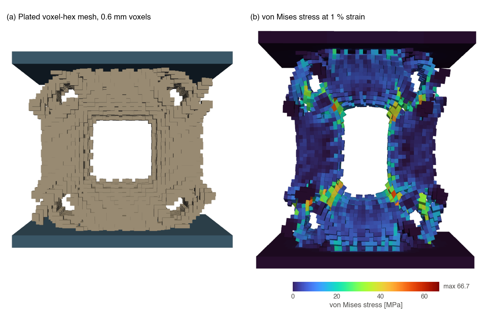
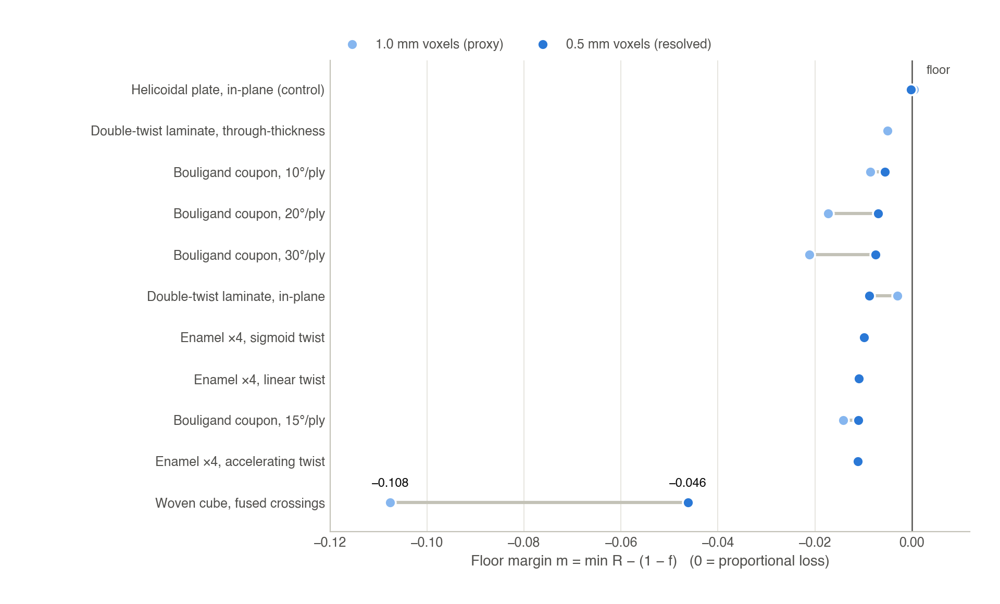

# Finite-element instruments: voxel-hex tension and damage tolerance

This document describes the finite-element chain that turns a generated STL into mechanical
numbers: the plated voxel-hex mesher, the linear effective-modulus solve, the finite-strain
(neo-Hookean) tension solver, the algebraic-multigrid solver option, and the flaw-seeded
damage-tolerance screen (test method TM-3). Fracture — crack twisting and deflection, which a
stiffness screen cannot resolve — is covered by the phase-field instrument in
[FRACTURE.md](FRACTURE.md). Terms and acceptance criteria are controlled in
[ABCAD-QMS-002](qms/ABCAD-QMS-002_definitions_and_tests.pdf).

All quantities use millimetres, newtons, and megapascals. The default solid is a photopolymer-like
isotropic material, E = 3000 MPa and ν = 0.40.

| Module | Role | Interpreter |
|---|---|---|
| [`abcad/fea/voxel_plate_mesh.py`](../abcad/fea/voxel_plate_mesh.py) | STL → plated voxel-hex mesh (+ A₀/H₀ sidecar) | `ABCAD_CAD_PYTHON` |
| [`abcad/fea/run_tension.py`](../abcad/fea/run_tension.py) | Linear small-strain uniaxial tension → E_eff | `ABCAD_SFEPY_PYTHON` (solve) |
| [`abcad/fea/run_tension_finite.py`](../abcad/fea/run_tension_finite.py) | Finite-strain neo-Hookean tension → stress–stretch curve | `ABCAD_SFEPY_PYTHON` |
| [`abcad/fea/fea_runner_amg.py`](../abcad/fea/fea_runner_amg.py) | SfePy runner with an optional AMG linear solver | `ABCAD_SFEPY_PYTHON` |
| [`abcad/fea/damage_tolerance.py`](../abcad/fea/damage_tolerance.py) | Flaw-seeded stiffness retention (TM-3) | `ABCAD_CAD_PYTHON` (drives the solves) |



*Figure 1. (a) The 29 mm woven specimen voxelized at 0.6 mm and fitted with top and bottom loading
plates (plates dark, members tan). (b) von Mises stress [MPa] in the same mesh at 1 % nominal
tensile strain; the highest stresses sit at the fiber crossings (element maximum 66.7 MPa, mean
4.5 MPa). This mesh gives E_eff = 67.7 MPa.*

---

## 1. STL to plated voxel-hex mesh

**Why voxel hexahedra.** Woven lattices are dense with near-tangent fiber crossings, and
tetrahedralizing such surfaces fails on self-intersections and zero-volume tetrahedra. An occupancy
grid with one 8-node hexahedron per solid voxel is watertight and single-component by construction
and loads directly into SfePy; it is the standard image-based micro-FE method.

**Why loading plates.** Solid slabs at the top and bottom, which the members penetrate, give flat
faces for the displacement and fixed boundary conditions and a single bonded load path, so the
specimen carries tension as well as compression (the bonded grip a tensile test needs). **The plates
must intersect the members a safe distance before the members end** (`--overlap`): fiber ends are
then embedded in the slab and bond into one load path, which is what makes the voxel body connect.

**Pipeline.**

```
watertight STL --VTK image-stencil voxelization--> occupancy grid (mm)
  --keep largest connected component--> drop voxelization speckle (floaters would be mechanisms)
  --add plates--> slabs over the full footprint, inner faces `overlap` inside the member z-extent
  --keep largest component again--> one connected solid spanning both plates
  --occupancy to hexahedra--> gmsh-2.2 hex mesh (mm) + sidecar JSON (A0, H0, voxel, counts)
```

Connectivity for "largest component" is selectable: `1` faces only, `2` faces and edges (default;
keeps staircased curved fibers together), `3` any touch.

```bash
"$ABCAD_CAD_PYTHON" -m abcad.fea.voxel_plate_mesh --stl part.stl --voxel 1.0 --plate 2.0 \
    --overlap 0.8 --connectivity 2 --msh "$ABCAD_OUT/part.msh" --png "$ABCAD_OUT/part_plated.png"
```

**Voxel size.** The thinnest member should span about 3–5 voxels (a 2 mm fiber at 0.5 mm is four
voxels). Too coarse and the network fragments (the mesher reports the kept fraction and whether the
body spans both plates); too fine and the element count, and with it the solve time, explodes. If a
plate is missed or more than half of the material is dropped, lower `--voxel`, raise `--overlap`
or `--connectivity`, or use a thicker-fiber specimen.

**Sidecar.** `<mesh>.msh.json` records the nominal footprint area A₀ [mm²] (the member bounding box),
the specimen height H₀ [mm], the voxel size, element and node counts, and the plate geometry. Every
reaction force is reduced to an effective stress and strain with these values.

## 2. Linear tension: effective modulus

[`abcad/fea/run_tension.py`](../abcad/fea/run_tension.py) applies a small-strain uniaxial tension
(bottom plate fixed, top plate displaced by ε·H₀) and reports the reaction force F and

  E_eff = (F / A₀) / (ΔL / H₀).

The solve reuses the SfePy runner and stock problem definition of the author's
biomimetic-lattice-pipeline package (installed with the `fea` extra, or located through
`ABCAD_BIOMIMETIC_PIPELINE`), and the solve itself runs in the SfePy environment; tension is
derived from the stock compression problem by flipping the sign of the top-face displacement, and
8-node hexahedra use the matching element-volume and centroid kernels. Linear elasticity is scale-invariant, so
E_eff/E does not depend on the absolute size of the part or on the strain magnitude; 1 % strain is
used so the result is unambiguously the small-strain modulus. Loading woven lattices in tension
probes the stretchable, entanglement regime.

```bash
"$ABCAD_SFEPY_PYTHON" -u abcad/fea/run_tension.py --msh "$ABCAD_OUT/part.msh" --E 3000 --nu 0.40 \
    --strain 0.01
```

Outputs: the SfePy field dump and result CSVs in the working directory and an `e_eff.json` summary.

**Absolute E_eff depends on the voxel resolution.** The same 29 mm woven specimen:

| Mesh | Voxel [mm] | Plate / overlap [mm] | Hexahedra | Solver | E_eff [MPa] | E_eff / E |
|---|---|---|---|---|---|---|
| `woven_fea_small.msh` | 0.6 | 1.8 / 1.2 | 34,974 | direct | 67.7 | 2.26 % |
| `woven_fea_tiny.msh` | 0.8 | 2.4 / 1.6 | 17,685 | direct (1.5 % strain) | 91.8 | 3.06 % |
| damage-tolerance intact mesh | 1.0 | 2.0 / 0.8 | 8,262 | direct | 82.7 | 2.76 % |
| `woven_v05.msh` | 0.5 | 2.0 / 0.8 | 63,334 | AMG | 47.7 | 1.59 % |

At an identical plating recipe, the 1.0 mm proxy is 73 % stiffer than the 0.5 mm mesh (82.7 versus
47.7 MPa): with Ø 0.8–1 mm fibers only one to two voxels wide, the staircase fattens members and
over-welds crossings. Retention ratios and rankings built on one recipe remain meaningful because
numerator and denominator share it, but any absolute E_eff statement must cite its voxel size.

## 3. Finite-strain tension (validated)

[`abcad/fea/run_tension_finite.py`](../abcad/fea/run_tension_finite.py) solves uniaxial tension under
geometric nonlinearity, so stiffening that a linear solver cannot show can appear. It is a
self-contained total-Lagrangian, compressible neo-Hookean formulation (SfePy terms
`dw_tl_he_neohook` for shear and `dw_tl_bulk_penalty` for the bulk response, with μ = E/2(1 + ν) and
K = E/3(1 − 2ν)), solved with Newton iterations and load-stepped by ramping the top displacement
(strain control). Because the residual returned by SfePy is reduced to the free degrees of freedom,
the reaction is recovered at each saved step by re-evaluating the full internal-force vector with
the essential boundary conditions cleared and summing its z-component over the fixed-face nodes.

**Validation.**

| Check | Result |
|---|---|
| Block, `--block 10,10,20,5,5,9` (10 × 10 × 20 mm) | E_eff = 3080.8 MPa = 102.7 % of E = 3000 MPa; concave neo-Hookean response |
| Real lattice mesh (`woven_fea_tiny.msh`, 17,685 hex), small strain | E_eff = 93.1 MPa versus 91.8 MPa from the linear solve on the same mesh (+1.4 %) |
| Reaction extraction | identical (relative difference 0.0) to an independent companion assembly without essential boundary conditions |
| Equilibrium | interior residual 7 × 10⁻⁷ N, about 2 × 10⁻⁹ of the 386 N reaction |

Acceptance rule (SOP-001): the block must recover the solid modulus within about 5 %, and the
lattice result must agree with the linear reference on the same mesh to within a few percent at
small strain; an FEA conclusion that fails to recover the linear reference is not used. With the
direct solver, nonlinear meshes are kept at or below about 15–20 thousand hexahedra. The records
of both validation cases, re-run with the shipped driver, are in
[`results/fea_tension/finite_strain_validation/`](../results/fea_tension/finite_strain_validation/).

**Load-step size and convergence.** Every load step must reach Newton convergence; the driver
records each step's convergence flag, iteration count and final residual in the CSV, prints a
warning, and exits with status 3 when any loaded step fails. The block converges in 4 iterations
per step (residual about 10⁻⁹ N) with 1.67 % strain increments. The thin-fibre lattice does not:
a single 1.67 % increment exhausts the 12 Newton iterations with a residual of 1.0 × 10⁵ N, and
the reaction of such a step is meaningless. On lattices, use increments of about 0.5 % strain
(the validated setting); a lattice stress–stretch curve to large stretch therefore needs many
small steps and has not yet been recorded.

```bash
# Validated lattice setting: two 0.5 % steps (small-strain modulus from the first step)
"$ABCAD_SFEPY_PYTHON" -u -m abcad.fea.run_tension_finite --msh "$ABCAD_OUT/part.msh" \
    --max-strain 0.01 --nsteps 2
"$ABCAD_SFEPY_PYTHON" -u -m abcad.fea.run_tension_finite --block 10,10,20,5,5,9   # self-check
```

## 4. Algebraic-multigrid solver

Setting `ABCAD_FEA_SOLVER=amg` swaps SfePy's direct solver (`ls.scipy_direct`) for pyamg (smoothed
aggregation with conjugate gradients, relative tolerance 10⁻⁸) inside the generated problem file;
when the variable is unset the problem file is byte-identical to the stock one, so the validated
lineage is untouched. The switch passed an exact lineage bridge before any new number was accepted:
woven intact E_eff 82.698 versus 82.70 MPa, and the in-plane solid control 941.179 versus
941.2 MPa. It raises the practical mesh size from about 15–20 thousand to more than 100 thousand
hexahedra (timings in [PERF.md](PERF.md)), which is what makes 0.5 mm voxels — and therefore
resolved plies, grooves, and fiber gaps — affordable.

---

## 5. Damage tolerance: flaw-seeded stiffness retention (TM-3)

[`abcad/fea/damage_tolerance.py`](../abcad/fea/damage_tolerance.py) measures how much effective
stiffness an architecture retains when material goes missing — a model for print defects, service
damage, or deliberate strut removal. It composes only the validated pieces above:

```
STL -> voxelize -> keep largest -> add plates -> intact mesh
    -> per replicate: carve N spherical flaws in the member region (plates immune), re-clean
    -> linear tension solve per mesh -> E_eff per variant -> retention per replicate
```

**Definitions.**

| Quantity | Definition |
|---|---|
| Flaw model | Per damaged replicate, N = 3 spherical flaws of radius r = 1.5 mm carved into member voxels, with centers kept one flaw radius clear of the plate faces; 3 replicates with pinned seeds (base seed 20260703) |
| Dose f | Fraction of member material removed by the flaws |
| Retention R | E_eff(damaged) / E_eff(intact) on identically meshed geometry |
| Proportional-loss floor | 1 − f: the retention of a structure in which every removed element carried exactly its volumetric share of load |
| Floor margin m | m = R − (1 − f), evaluated with the worst replicate R and the mean dose. m > 0: redundant, damage-tolerant load paths; m ≈ 0: continuum-proportional; m < 0: load-path-sensitive (flaws sever critical members). **The ranking quantity.** |
| Score | Minimum retention over the replicates, always reported with its dose and margin |

**Validity gates.** A run is recorded as invalid, never as a number, if (TM3-V1) the intact E_eff
exceeds the material modulus by more than 2 % — the signature of a degenerate remnant or a broken
A₀/H₀ normalization — or (TM3-V2) the largest connected component retains less than 70 % of the
voxelized material, which means the part is disconnected at that voxel size. Coupons must also
obey the design rules below.

**Coupon design rules (TM-5).** Features that carry the architecture signal must span at least two
voxels; sub-voxel features (0.2 mm laminate plies at h ≥ 1.0 mm) vanish, and such parts measure as
solid controls and must be labeled so. Crossing members must interpenetrate by at least 0.4 mm to
weld reliably at 1 mm voxels (a contact lens about 1.6 mm wide); tangent contacts do not weld. The
intact mesh must fit the solver's hexahedron budget, checked with a dry voxel count.

```bash
"$ABCAD_CAD_PYTHON" -m abcad.fea.damage_tolerance --stl part.stl --voxel 1.0 --samples 3 \
    --nflaws 3 --flaw-radius-mm 1.5
# 0.5 mm resolved protocol (requires ABCAD_FEA_SOLVER=amg)
ABCAD_FEA_SOLVER=amg "$ABCAD_CAD_PYTHON" -m abcad.fea.damage_tolerance --stl part.stl --voxel 0.5
```

Outputs: `damage_tolerance.json` (configuration, per-variant E_eff, retention summary), `report.md`,
and the intact and damaged meshes.

### 5.1 Results



*Figure 2. Floor margin m = R − (1 − f) for each architecture at the 1.0 mm proxy resolution (light)
and the 0.5 mm resolved resolution (dark). Zero is proportional loss. The coarse proxy exaggerated
the spread; at 0.5 mm only the fused woven cube falls meaningfully below the floor.*

**0.5 mm resolved protocol (ranking of record; AMG solver).**

| Architecture (load direction) | Intact hex | E_eff [MPa] | Min R | Mean R | Dose f | Floor 1 − f | Margin m |
|---|---|---|---|---|---|---|---|
| Helicoidal laminate plate, in-plane (solid control) | 118,004 | 554.0 | 0.997 | 0.997 | 0.0030 | 0.9970 | −0.0002 |
| Bouligand coupon, Δθ = 10°/ply | 107,200 | 446.3 | 0.991 | 0.992 | 0.0036 | 0.9964 | −0.0055 |
| Bouligand coupon, Δθ = 20°/ply | 106,327 | 474.4 | 0.990 | 0.992 | 0.0032 | 0.9968 | −0.0070 |
| Bouligand coupon, Δθ = 30°/ply | 104,744 | 520.3 | 0.989 | 0.992 | 0.0031 | 0.9969 | −0.0075 |
| Double-twist laminate, in-plane | 133,788 | 492.8 | 0.989 | 0.996 | 0.0025 | 0.9975 | −0.0088 |
| Enamel lattice ×4, sigmoid twist | 61,006 | 1120.5 | 0.985 | 0.986 | 0.0051 | 0.9949 | −0.0098 |
| Enamel lattice ×4, linear twist | 62,655 | 1096.0 | 0.984 | 0.987 | 0.0047 | 0.9953 | −0.0109 |
| Bouligand coupon, Δθ = 15°/ply | 106,584 | 447.8 | 0.986 | 0.988 | 0.0035 | 0.9965 | −0.0110 |
| Enamel lattice ×4, accelerating twist | 61,880 | 1115.9 | 0.984 | 0.986 | 0.0049 | 0.9951 | −0.0111 |
| **Woven cube, fused crossings** | 63,334 | 47.7 | 0.947 | 0.963 | 0.0070 | 0.9930 | **−0.0462** |

**1.0 mm proxy protocol** (near-solid laminate plates at 1.25 mm to stay inside the direct solver's
hexahedron budget; the deviation is disclosed in each record).

| Architecture (load direction) | Voxel [mm] | Intact hex | E_eff [MPa] | Min R | Dose f | Margin m |
|---|---|---|---|---|---|---|
| Helicoidal laminate plate, in-plane (solid control) | 1.25 | 8,431 | 941.2 | 0.998 | 0.0030 | +0.0005 |
| Double-twist laminate, in-plane | 1.25 | 9,698 | 896.9 | 0.994 | 0.0026 | −0.0030 |
| Double-twist laminate, through-thickness | 1.25 | 12,781 | 732.0 | 0.988 | 0.0069 | −0.0050 |
| Bouligand coupon, Δθ = 10°/ply | 1.0 | 13,681 | 845.2 | 0.984 | 0.0073 | −0.0086 |
| Bouligand coupon, Δθ = 15°/ply | 1.0 | 13,636 | 812.9 | 0.979 | 0.0069 | −0.0141 |
| Bouligand coupon, Δθ = 20°/ply | 1.0 | 13,772 | 819.7 | 0.975 | 0.0074 | −0.0173 |
| Bouligand coupon, Δθ = 30°/ply | 1.0 | 13,486 | 842.0 | 0.972 | 0.0072 | −0.0211 |
| **Woven cube, fused crossings** | 1.0 | 8,262 | 82.7 | 0.881 | 0.0116 | **−0.1076** |

Margins are computed from the unrounded records.

### 5.2 Findings

1. **The instrument's zero point is verified.** The solid control sits at its floor at both
   resolutions (m = +0.0005 at 1.25 mm, −0.0002 at 0.5 mm): a continuum responds proportionally, so
   nonzero margins on architected parts are signal, not a meshing artifact.
2. **The coarse proxy exaggerated the spread.** At 1.0 mm the margins run from +0.0005 to −0.108;
   at 0.5 mm everything except the woven cube collapses to between −0.0002 and −0.011. The
   staircase of the coarse grid manufactured flaw sensitivity that the resolved geometry does not
   have.
3. **The fused woven cube is the only genuine outlier** (m = −0.046 at 0.5 mm, about 2.3× less
   extreme than the proxy's −0.108). It is the most open architecture (E_eff = 47.7 MPa, 1.6 % of
   the solid), and because its voxel-welded crossings make the fibers one monolithic network,
   severing a fiber removes load paths. The literature's damage-tolerant woven lattices are
   non-fused (fibers slide and entangle); the non-fused case is examined in FRACTURE.md §5.
4. **Enamel ranks with the solid controls and the Bouligand coupons** (m ≈ −0.010 to −0.011) and
   is the stiffest family (E_eff ≈ 1100 MPa, about 37 % of the solid), because the printable rod
   packing is nearly solid.
5. **Neither the twist law nor the Bouligand pitch changes TM-3 meaningfully.** Sigmoid, linear,
   and accelerating twists differ by about 0.001 in margin, and the four pitches span less than
   0.006 at 0.5 mm. At 1.0 mm the pitch trend is monotonic (finer pitch marginally better), as expected of a
   stiffness measure.
6. **Linear-screen limitation.** TM-3 is a stiffness retention under material removal. It cannot see
   crack-twisting work of fracture — the mechanism behind the pitch dependence of printed-Bouligand
   toughness (LITERATURE.md §1.6) and behind enamel decussation. The fracture instrument (FRACTURE.md)
   resolves the crack-path effects that TM-3 misses: deflection steered by rod orientation and a
   pitch-dependent crack tortuosity that peaks inside the literature band.
