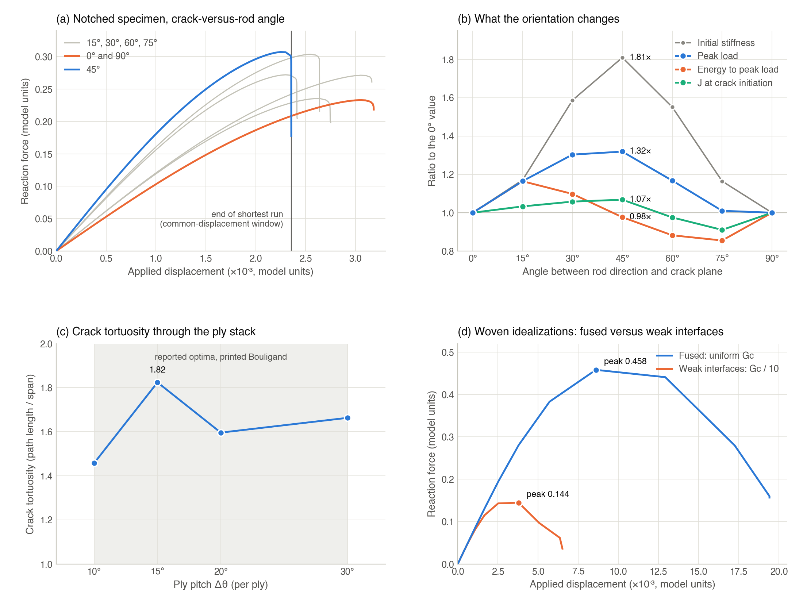
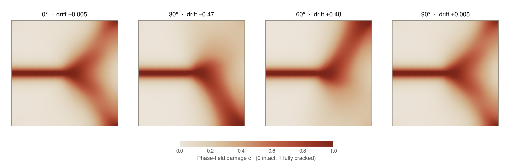
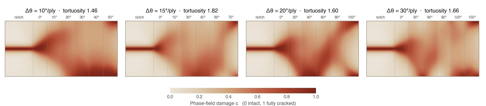
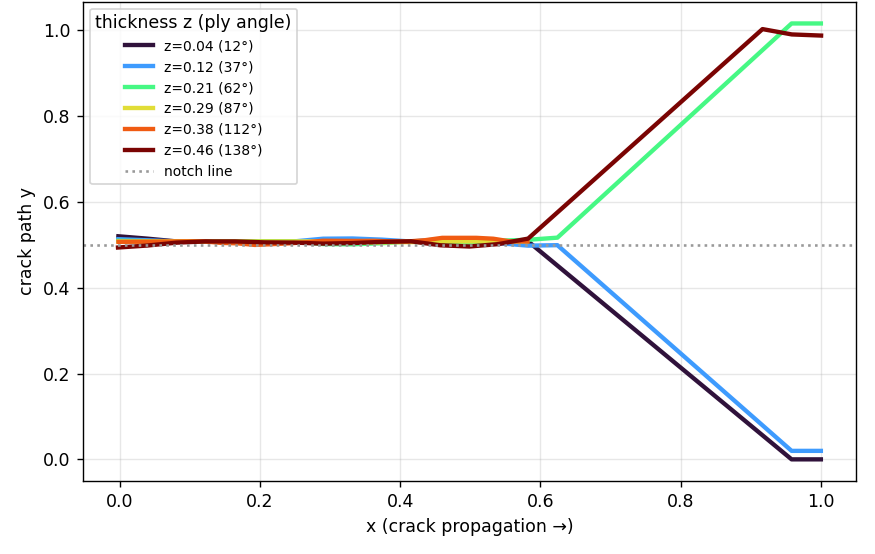
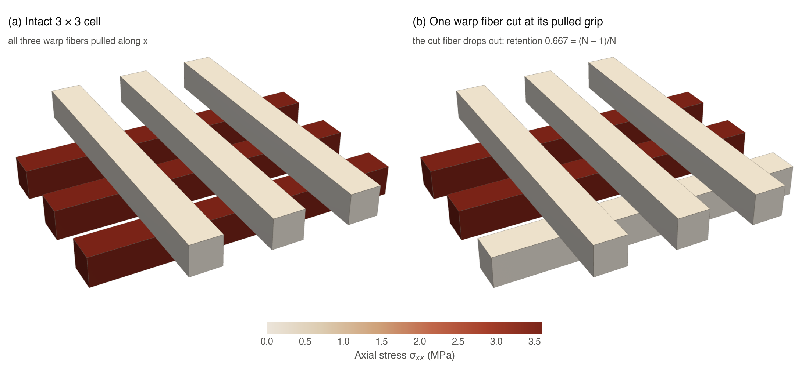

# Phase-field fracture instrument (test method TM-6)

The damage-tolerance screen of [FEA.md](FEA.md) (TM-3) is a linear stiffness measure. It showed
that the design levers of the helicoidal and enamel families — ply pitch and twist law — make
almost no difference to stiffness retention, because their toughening mechanism is the crack path
itself: a crack forced to twist and deflect through rotating weak planes dissipates more energy
(LITERATURE.md §1.5, §3). TM-6 measures that mechanism directly with phase-field fracture, the
J-integral, and frictional contact in MOOSE, entirely on local hardware.

TM-6 is the depth instrument. The fast voxel-hex screens remain the in-loop gates; the fracture
decks answer the questions the screens cannot.

| Capability used | MOOSE module |
|---|---|
| Linear and anisotropic elasticity, J-integral (`DomainIntegral`) | `solid_mechanics` |
| Phase-field fracture (Allen–Cahn damage, spectral split) | `phase_field` (with `solid_mechanics`) |
| Frictional penalty contact between separate bodies | `contact` |

All runs use the `combined` application, which contains all three modules.



*Figure 1. (a) Load–displacement curves of the notched half model at each crack-versus-rod angle;
the vertical line marks the end of the shortest run, which bounds the work-to-common-displacement
window. (b) Ratios to the 0° value: the peak-load gain follows the initial stiffness of the rotated
anisotropic material, the energy absorbed up to peak load does not increase, and J at crack
initiation rises by 7 % at 45°. (c) Crack tortuosity through the ply architecture of the four
Bouligand pitch coupons as traced in July 2026 (see the reproducibility note in §5); the shaded band
is the 10–30° per ply range of reported optima for printed Bouligand structures (LITERATURE.md §1.6). (d) Fused (uniform G_c) versus weak-interface ("non-fused") woven idealization: weak
interfaces delaminate and fail early. Model units in (a) and (d).*

---

## 1. Setup

- **Environment.** MOOSE from the INL conda channel (`moose-dev=2026.06.16`, OpenMPI build) in a
  dedicated conda environment, with the `combined` application built from MOOSE source at commit
  `a628b5c0`:

  ```bash
  conda create -n moose "moose-dev=2026.06.16=openmpi" \
      -c https://conda.software.inl.gov/public -c conda-forge --solver=libmamba -y
  # recent macOS releases may additionally need CONDA_OVERRIDE_OSX=15.0 for the solve
  ```

- **Running a deck.** `ABCAD_MOOSE_EXEC` points at the built `combined-opt` executable and
  `ABCAD_MOOSE_ENV` names the conda environment that provides its runtime libraries (default
  `moose`). MOOSE writes its outputs next to the input file, so a deck is copied into the output
  directory and run there, never inside the package; parameters are overridden on the command line
  in MOOSE's `Block/param=value` syntax:

  ```bash
  mkdir -p "$ABCAD_OUT/fracture" && cp abcad/fracture/decks/tm6_twist.i "$ABCAD_OUT/fracture/"
  cd "$ABCAD_OUT/fracture" && conda run --no-capture-output -n "${ABCAD_MOOSE_ENV:-moose}" \
      "$ABCAD_MOOSE_EXEC" -i tm6_twist.i Materials/elasticity_tensor/euler_angle_1=45 \
      Outputs/file_base=tm6_a45
  ```

  The repository's `justfile` wraps this as `just fracture <deck> [overrides]` (run
  `just fracture validate_uniaxial` first; it is the validation gate) and the deck generators as
  `just deck-bouligand`, `just deck-3d-twist`, `just deck-3d-jintegral`, `just deck-woven-cell`, and
  `just deck-woven-fracture`.

- **Decks and generators.** Static decks live in [`abcad/fracture/decks/`](../abcad/fracture/decks/)
  and the deck generators, analysis, and rendering scripts in
  [`abcad/fracture/`](../abcad/fracture/):

  | File | Purpose |
  |---|---|
  | `validate_uniaxial.i` | Validation gate: solid bar in uniaxial tension, project units |
  | `tm6_benchmark_K.i` | Validation: single-edge-notch tension J-integral against the closed-form K |
  | `tm6_twist.i`, `tm6_video.i` | 2D phase-field crack versus rod orientation (half model); video variant |
  | `tm6_jintegral.i`, `tm6_jintegral_pla.i` | 2D elastic J-integral versus orientation; PLA-calibrated variant |
  | `tm6_stageD.i` | 2D full model: seeded internal crack, free to deflect |
  | `tm6_stageD_3d.i` | 3D phase-field crack through a block |
  | `tm6_contact_crossover.i` | Two crossing fibers with frictional contact |
  | `tm6_make_bouligand_deck.py` | Ply-strip Bouligand coupon deck (pitch, number of plies) |
  | `tm6_make_3d_twist_deck.py`, `tm6_make_3d_jintegral_deck.py` | 3D rotating-plywood phase-field and J-integral decks |
  | `tm6_make_woven_cell_deck.py` | N × N non-fused woven cell with frictional crossings |
  | `tm6_make_woven_fracture_deck.py` | Fused versus weak-interface woven fracture deck |
  | `tm6_analyze.py`, `tm6_fracture_compare.py` | Work of fracture and peak load from the CSV output |
  | `tm6_render_*.py` | Crack-field images and videos from Exodus output |

- **Units.** The validation decks and the PLA-calibrated decks use millimetres, newtons, and
  megapascals, so J is in N/mm = kJ/m² and K in MPa·√m. The orientation, deflection, Bouligand, and
  woven phase-field studies use the anisotropic test material of MOOSE's phase-field regression
  suite (cubic stiffness C₁₁ = 127, C₁₂ = 70.8, C₄₄ = 73.55, G_c = 10⁻³, length scale
  l = 0.04–0.05, viscosity 10⁻⁶) in model units; their results are relative comparisons.
- **Work of fracture.** W = ∫ R d(u), the area under the reaction–displacement curve, integrated to a
  displacement common to all compared runs (the smallest maximum displacement), after removing
  repeated rows from failed time steps, so that runs ending at different displacements are compared
  over the same window. Between specimens of different stiffness this quantity also scales with
  the stiffness and must be read together with the stiffness ratio and the energy to peak load
  (§3.1).

## 2. Validation ladder

No MOOSE number enters a record until the instrument reproduces known answers.

| # | Check | Deck | Result |
|---|---|---|---|
| 1 | Elasticity and units | `validate_uniaxial.i`: 4 × 4 × 8 mm bar, E = 3000 MPa, ν = 0.40, 1 % strain | E_eff = 3000.00 MPa, 0.000 % error against the analytic value and in agreement with the SfePy solid control |
| 2 | Path independence of J | all J decks | Integration rings agree to better than 0.1 % (0.08 % in the benchmark) |
| 3 | Closed-form fracture mechanics | `tm6_benchmark_K.i`: single-edge-notch tension, isotropic, a/W = 0.2, remote traction σ = 3 MPa, free sides | K_I = F(a/W)·σ·√(πa) with F(0.2) = 1.371 and J = K_I²/E′ (plane strain) give J_analytic = 3.223 × 10⁻³; MOOSE gives J = 3.077 × 10⁻³, a ratio of 0.955 (−4.5 %) |

The remaining −4.5 % is attributable to finite width, crack-tip mesh resolution, and the 1–2 %
accuracy of the handbook geometry factor. **Lesson recorded by the benchmark:** a crack lying on a
symmetry plane needs `symmetry_plane = <normal axis>` in the `DomainIntegral` block; without it the
half-contour J is exactly a factor of two low. The correction doubled the absolute J values of the
orientation sweep but left its relative result unchanged, because the factor cancels.

Rungs not yet run: mesh and length-scale convergence (refine the mesh, halve l, and confirm that J
and the toughness trends are l-independent); the literature pitch band with a fully resolved
three-dimensional model; and comparison with measured toughness of printed coupons (for example
ASTM D5045 on printed Bouligand and enamel coupons).

## 3. Crack-versus-rod orientation

### 3.1 Phase-field sweep (half model)

`tm6_twist.i` loads a single-edge-notched specimen (1.0 × 0.5, notch along the left half of the
bottom symmetry edge) of the anisotropic test material in displacement-controlled mode I and
rotates the material axes by `euler_angle_1` ∈ {0, 15, 30, 45, 60, 75, 90}°, the angle between the
rod direction and the crack plane. Each run is driven past its peak load. All quantities below are
computed from the load–displacement records of the sweep (model units).

| Angle | 0° | 15° | 30° | 45° | 60° | 75° | 90° |
|---|---|---|---|---|---|---|---|
| Initial stiffness, ratio to 0° | 1.00 | 1.17 | 1.59 | **1.81** | 1.55 | 1.16 | 1.00 |
| Peak load | 0.2329 | 0.2712 | 0.3035 | **0.3071** | 0.2719 | 0.2352 | 0.2329 |
| Displacement at peak (× 10⁻³) | 3.05 | 3.05 | 2.55 | 2.25 | 2.30 | 2.60 | 3.05 |
| Energy to peak load (× 10⁻⁴) | 4.25 | 4.95 | 4.66 | 4.15 | 3.75 | 3.63 | 4.25 |
| Work to common displacement (× 10⁻⁴) | 2.687 | 3.131 | 4.062 | **4.475** | 3.883 | 3.052 | 2.687 |

The 45° specimen carries 1.32× the peak load of the axis-aligned (0° and 90°) specimen, and the
area under its curve up to a common displacement of 2.36 × 10⁻³ (the end of the shortest run) is
1.67× larger. **Both ratios, however, track the elastic anisotropy rather than fracture
resistance.** Rotating the cubic material by 45° makes the specimen 1.81× stiffer in the loading
direction, so it carries more load at every displacement and reaches its peak earlier (2.25 versus
3.05 × 10⁻³). The energy absorbed up to the peak load is essentially orientation-independent
(0.98× at 45°). The common-displacement window closes after the 45° peak but before the 0° and 90°
peaks (Figure 1a), which is why the work-to-common-displacement ratio mostly measures stiffness,
and every run ends shortly after its peak, with the reaction only 4–42 % below the peak value, so
the sweep contains no propagation work. What the sweep does establish is the symmetry check (0°
and 90° agree to numerical precision, as the cubic material requires) and the elastic context for
the J-integral and deflection studies below. Its symmetry plane also forces the crack to stay
straight. Quantifying orientation toughening needs propagation work per unit crack extension (a
resistance curve) from a full-model run to separation, or an experiment.

Animated: [crack at 45°](figures/crack_propagation_45deg.gif) and
[crack at 0°](figures/crack_propagation_0deg.gif), each with the load–displacement point tracked.
The animations come from a higher-viscosity variant of the deck (`tm6_video.i`) run to complete
separation for filming; the half model is shown mirrored about its crack plane, with the notch
(a free boundary in that model) drawn in, and the frames follow the run's progress so the crack's
advance through the load drop is filmed.

### 3.2 J-integral at initiation (elastic, symmetry-corrected)

`tm6_jintegral.i` removes the damage field, keeps a sharp edge notch, and evaluates J with three
integration rings around the tip as a function of the applied displacement for each orientation.
Evaluated at the displacement where the phase-field specimen initiates, J is an effective
initiation toughness:

| Angle | 0° | 15° | 30° | 45° | 60° | 75° | 90° |
|---|---|---|---|---|---|---|---|
| J at initiation (× 10⁻³) | 1.575 | 1.627 | 1.667 | **1.682** | 1.537 | 1.434 | 1.575 |

J at initiation peaks at 45° (1.17× its minimum over the sweep and 1.07× the axis-aligned
value). Unlike the load and work ratios of §3.1, J at initiation is an energy release rate
evaluated at the moment the crack starts — a toughness-like quantity rather than a load — and it
shows a modest orientation effect of about 7 % between 45° and 0°. The initiation displacements
come from the phase-field runs' coarse sampling of the peak, so the 45° maximum is robust while the
minimum at 75° is partly a sampling effect.

### 3.3 PLA-calibrated magnitudes

`tm6_jintegral_pla.i` scales the problem to PLA stiffness (E ≈ 3.5 GPa) in millimetre units: a
20 mm coupon with a 4 mm edge crack under a 30 MPa remote stress. The elastic driving force is
K ≈ 4.9–5.1 MPa·√m across orientations, lowest at 45°. With an assumed intrinsic PLA toughness of
K_c ≈ 3.5 MPa·√m (G_c ≈ 3.05 kJ/m²), the predicted fracture stress is about 5 % higher at 45° than
at 0° and 90°. The 3D counterpart (`tm6_make_3d_jintegral_deck.py`, 30° per ply, five ply slabs)
evaluates J along the through-thickness crack front: interior values are K ≈ 4.8–5.0 MPa·√m, with
the lowest driving force (4.82 MPa·√m) at the depth of the 90° ply; the two end points, where the
front meets the free surfaces, are inflated by the free-surface singularity and are excluded.

**Interpretation.** On a flat crack, orientation changes the initiation driving force by only about
5–10 %. Larger effects are expected during propagation, when the crack must deflect and twist
through rotating plies (§4–§6); an elastic J on a flat crack does not capture them, and their
energy consequence has not yet been quantified (§3.1).

## 4. Crack deflection (full model)

`tm6_stageD.i` removes the symmetry plane: a unit square with a seeded internal crack at mid-height
(x < 0.5), smeared as exp(−|y − 0.5|/l) so the phase-field solve starts cleanly, with
irreversibility enforced by a variational-inequality bounded solver. The crack is free to deflect.



*Figure 2. Final damage field of the full model at four rod orientations (the last converged step
of each run). At 0° and 90° the crack grows straight from the notch and then branches
symmetrically toward both far corners, with no net drift; at 30° and 60° it is steered toward
opposite edges, symmetric about 45°.*

| Rod angle | 0° | 30° | 60° | 90° |
|---|---|---|---|---|
| Crack drift from mid-height (fraction of specimen height) | +0.005 | −0.47 | +0.48 | +0.005 |

The rod orientation steers the crack: axis-aligned material leaves it without net drift, whereas
30° and 60° deflect it in opposite directions, symmetric about 45°. Deflection toward the weak plane is the
ingredient that a rotating-plywood architecture repeats ply after ply. Animated: [deflection in a 60° rod field](figures/crack_deflection_60deg.gif).

**Reproducibility (2026-09-26).** Re-running the shipped deck reproduces this pattern; the
fields in Figure 2 are from that re-run. The drift values in the table were recorded in July 2026
with a measure that was not archived. A documented re-measurement on the re-run fields, the
damage-weighted height of the fully damaged material (c ≥ 0.5) on the far edge relative to
mid-height (`edge_drift` in `docs/figures/src/field_render.py`), gives −0.42 at 30°, +0.42 at 60°
and 0.00 at 0° and 90°. The off-axis runs end where the crack reaches the edge and the solve can
no longer converge (t = 0.0187 at 30°, 0.0144 at 60°, of 0.02).

## 5. Bouligand coupons: crack twisting through the real ply pitch

`tm6_make_bouligand_deck.py` represents a Bouligand coupon's architecture as N vertical ply strips,
strip k rotated by k·Δθ — the per-ply twist of the corresponding pitch coupon
(`bouligand_d10_w` … `bouligand_d30_w`, GENERATORS.md §1.6). This is an orientation idealization of
the coupon's ply design, not a voxel-resolved model of its fibers. A crack seeded at the left is
driven across six plies with the validated full-model solver.



*Figure 3. Final damage field for pitch angles of 10, 15, 20, and 30° per ply (the last converged
step of each run). Strip boundaries are dotted and each ply is labeled with its rod angle; the
region left of the first boundary is the notch. The crack changes direction at every ply as the
weak plane rotates. Titles give the tortuosity recorded in July 2026.*

| Pitch (° per ply) | 10 | 15 | 20 | 30 |
|---|---|---|---|---|
| Crack tortuosity (path length / span) | 1.458 | **1.824** | 1.596 | 1.663 |
| Twist amplitude (fraction of height) | 0.369 | 0.453 | 0.410 | 0.477 |
| Work of fracture (model units) | 0.01525 | 0.01403 | 0.01415 | 0.01126 |

**The crack twists through every pitch: at every ply boundary the damage changes direction as the
weak plane rotates.** In the July 2026 measurement the tortuosity peaked at 15° per ply, inside the
10–30° per ply range of reported optima for printed Bouligand structures (LITERATURE.md §1.6), but
the location of that peak depends on how a path is traced through damage that spreads and branches
(below), so it is not a located optimum. The evidence is first-order: two-dimensional, six plies,
one realization per pitch, and a coarse mesh; the work of fracture is noisy and does not track
tortuosity (it is highest at 10°). Locating a pitch optimum needs finer meshes, more plies,
replicates, and a crack-path measure that is robust to diffuse, branching damage.

**Reproducibility (2026-09-26).** Re-running the generated decks reproduces the damage fields;
Figure 3 shows the re-run. The tortuosity values in the table were traced in July 2026 with a method
that was not archived. With a documented measure, the column-wise damage maximum where the damage
reaches a threshold, and path length over horizontal span (`crack_path` and `path_tortuosity` in
`docs/figures/src/field_render.py`), the re-run gives 1.36, 1.73, 2.13 and 2.61 at 10, 15, 20 and
30° per ply for c ≥ 0.5, rising with pitch, and 1.13, 1.05, 1.94 and 1.51 for c ≥ 0.9.

## 6. Three-dimensional cracks

- **Capability.** `tm6_stageD_3d.i` (1 × 1 × 0.5 block, 30 × 30 × 15 hexahedra, about 50,000
  degrees of freedom) propagates a phase-field crack through the full thickness and deflects it;
  2,285 nodes end fully cracked, with a peak memory of 1.47 GB. Animated:
  [3D crack formation](figures/crack_3d_formation.gif).
- **Twisted fracture surface.** `tm6_make_3d_twist_deck.py` builds a rotating-plywood block whose
  thickness is divided into six ply slabs rotated 0 → 150° (30° per ply; 36 × 26 × 18 hexahedra).
  The twisting plies resisted the crack strongly — it barely advanced under six times the load of
  the 2D model — and then snapped through, leaving a fracture surface that **twists through the
  thickness**: the crack front sits near y ≈ 0.01 at the 0° face and y ≈ 0.99 at the 150° face.



*Figure 4. Crack path y(x) of the 3D rotating-plywood block, sliced at six depths z (the ply angle
at each depth is given in the legend). Near the 0° face the path deflects downward, near the 150°
face upward: the fracture surface is a twisted sheet.*

A gradual, quasi-static propagation of the twisting crack is compute-bound on a 16 GB workstation
(about four minutes per time step during propagation, peak memory about 2.8 GB); the snap-through
provides the final surface. A smooth propagation sequence requires a parallel (MPI) run.

## 7. Non-fused woven lattices: contact and fracture

TM-3 found the fused woven cube to be the only architecture clearly below the proportional-loss
floor, because voxel-welded crossings make its fibers one monolithic network (FEA.md §5.2). The
woven lattices of the literature are non-fused: fibers slide and entangle. Three studies test
whether non-fused crossings add damage tolerance.

### 7.1 Frictional crossover

`tm6_contact_crossover.i` presses two PLA-like bars (E = 3500 MPa, ν = 0.36) together and drags one
across the other with Coulomb penalty contact (μ = 0.3). The shear force transmitted through the
crossing rises until friction is overcome and then plateaus at about 20 N while the fibers slide
(stick–slip) — the sliding mechanism a fused joint lacks.

### 7.2 Stiffness retention of a non-fused woven cell

`tm6_make_woven_cell_deck.py` builds an N × N plain weave: N warp fibers along x (bottom layer) and N
weft fibers along y (top layer), each a separate 2 × 2 mm body, with frictional contact (μ = 0.3) at
every warp–weft crossing. The warps are gripped at both ends and pulled by 0.02 mm; the wefts can be
pressed down by a preload to engage friction. Loading is staged (preload over t ∈ [0, 0.25], pull
over t ∈ [0.25, 1]). The flaw is a cut warp: its pulled grip is freed, so it carries no applied
tension but stays anchored at the other end and can still be dragged by the wefts.



*Figure 5. Axial stress σ_xx in a 3 × 3 non-fused woven cell, intact (left) and with one warp fiber
cut (right). The cut fiber carries almost no stress; its neighbors carry the same load as before.*

| Cell | Crossings | Intact force [N] | Damaged force [N] | Retention | Geometric (N − 1)/N |
|---|---|---|---|---|---|
| 2 × 2 (1 of 2 warps cut) | 4 | 52.41 | 26.21 | **0.500** | 0.500 |
| 3 × 3 (1 of 3 warps cut) | 9 | 59.33 | 39.55 | **0.667** | 0.667 |

**Retention equals the geometric fraction (N − 1)/N exactly, independent of preload**: the intact
force is 52.41 N with or without preload, and the damaged 2 × 2 cell carries about 26.2 N either
way. In an intact cell all warps move together, so there is no relative slip at the crossings and
friction is inert; a cut fiber simply drops out. At small strain, frictional crossings in a flat
plain weave cannot transfer a parallel fiber's axial load to its neighbors, so **non-fused
crossings provide no linear-stiffness redundancy.** This is consistent with the enamel twist-law
and Bouligand pitch results of TM-3: non-fused woven damage tolerance is not a stiffness
phenomenon. The toughening reported for entangled woven lattices (compliance, stretch to λ = 4,
programmable failure) belongs to the large-deformation and fracture regime.

### 7.3 Fracture: weak interfaces versus fused material

`tm6_make_woven_fracture_deck.py` drives a mode-I crack through a notched unit square (plane strain,
brittle AT2 phase field, variational-inequality solver, adaptive time stepping) in two
idealizations. Fused: uniform G_c. Non-fused: three horizontal weak interfaces where G_c dips to
one tenth of its value, standing in for delaminating or sliding crossings.

| Idealization | Peak load | Energy to peak load | Work to common displacement | Work to end of run |
|---|---|---|---|---|
| Fused (uniform G_c) | 0.458 | 2.40 × 10⁻³ | 1.19 × 10⁻³ | 6.38 × 10⁻³ |
| Non-fused (weak interfaces, G_c/10) | 0.144 | 3.96 × 10⁻⁴ | 6.60 × 10⁻⁴ | 6.60 × 10⁻⁴ |
| Ratio, non-fused / fused | **0.32** | **0.16** | 0.55 | **0.10** |

Both idealizations have the same initial stiffness, so this comparison is not confounded by
elasticity. **Weak interfaces alone do not toughen: the crack uses them as an easy delamination
path and the specimen fails early**, at about one third of the fused peak load. Both runs end at a
similar mean damage (0.31 and 0.33), at which point the weak-interface specimen has absorbed about
one tenth of the fused specimen's work. The work to a common displacement (0.55×) understates the
penalty, because that window closes before the fused specimen reaches its peak. With the material
axes aligned to the load, both cracks branch symmetrically, because nothing gives the kink a
preferred direction.

### 7.4 Synthesis

Across these studies, the robust effect of oriented architecture is on the **crack path**:
off-axis material deflects the crack (§4), and rotating plies make it twist through the thickness
(§6) and change direction at every ply (§5; where the tortuosity peaks depends on how the diffuse
crack path is traced). Frictional sliding
per se gives no stiffness redundancy (§7.2), and weak interfaces per se delaminate (§7.3). The
simulations have not yet delivered the energy consequence of the longer, twisted path: the load and
work ratios of the orientation sweep are dominated by elastic anisotropy (§3.1). Measuring the
toughening therefore requires propagation work per unit crack extension — a full-model run to
separation normalized by crack area, a resistance curve, or a fracture test on printed coupons.
Making weak interfaces toughen, in turn, requires forcing tortuosity (for example a staggered,
brick-wall arrangement of weak planes) or coupling frictional contact to a propagating crack. A
linear stiffness screen is blind to all of these path effects; TM-6 resolves them.

## 8. Solver recipes

**Phase-field fracture.**

- Anisotropic elasticity requires the `stress_spectral` decomposition in
  `ComputeLinearElasticPFFractureStress`; the strain-spectral split fails for anisotropic tensors.
- Seed internal cracks smoothly (exp(−r/l)); a sharp step in the damage field stalls the nonlinear
  solve in the elastic regime.
- NEWTON with a direct LU factorization (`superlu_dist`) and `IterationAdaptiveDT` propagates
  robustly through brittle snap-through; matrix-free PJFNK with a fixed time step does not.
- Enforce irreversibility with the variational-inequality solver (`-snes_type vinewtonrsls`) and a
  `[Bounds]` block.
- A crack on a symmetry plane needs `symmetry_plane` in `DomainIntegral` (§2).
- A larger viscosity (5 × 10⁻⁵ instead of 10⁻⁶) produces gradual, filmable crack growth for videos.

**Frictional contact.**

- PJFNK with concurrent preload and pull drives the time step toward 10⁻⁸. Use NEWTON with
  `superlu_dist` and `automatic_scaling`, set a `dtmin` floor so failures are fast, stage the loading
  (seat the preload over t ∈ [0, 0.25], then pull over t ∈ [0.25, 1]), and pin the floating weft's
  in-plane rigid-body mode (y at its ends), otherwise Newton aborts.

**Post-processing.**

- VTK's Exodus reader applies displacements by default and mis-groups `disp_x/y/z` into a spurious
  vector baked into the coordinates. Disable it (`SetApplyDisplacements(False)` on the underlying
  reader) and color the undeformed mesh by the cell field.
- Integrate with `numpy.trapezoid` (`numpy.trapz` is removed in NumPy 2).

## 9. Scope and limitations

- The orientation, deflection, Bouligand, and woven studies are two-dimensional (except §6),
  single-realization, first-order results in model units; the transferable findings are the
  relative ones (the deflection symmetry, the ply-by-ply twisting, the retention identity, the
  delamination penalty) together with the caution that load and work ratios of anisotropic
  specimens must be separated from their stiffness difference.
- The Bouligand study uses an orientation idealization of the ply design, not the voxel-resolved
  fibers of the printed coupon.
- A quantitative resistance curve of a twisting crack (XFEM or phase field with a converged length
  scale), a surrogate over the design parameters, and experimental fracture toughness of printed
  coupons are the natural next measurements; MOOSE's `xfem`, `stochastic_tools`, and
  `heat_transfer` (print-process residual stress) modules provide the machinery.
