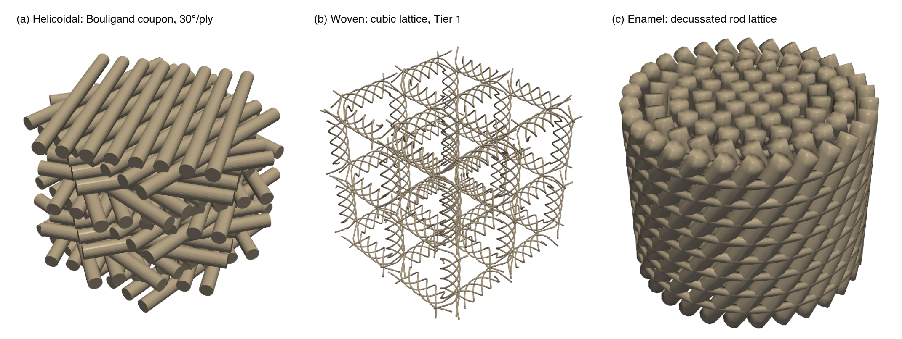
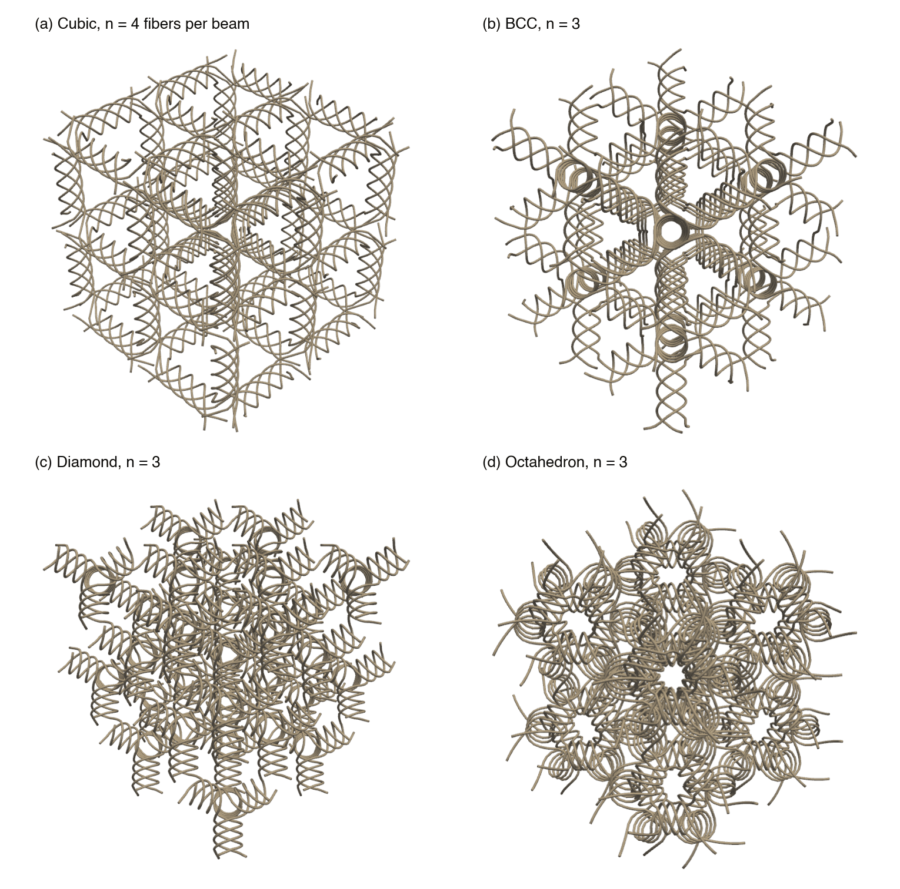

# Structure generators

`abcad` ships three parametric generator families for single-material, 3D-printable,
damage-tolerant architectures. Each family encodes one mechanism from
[LITERATURE.md](LITERATURE.md): rotating weak planes (helicoidal/Bouligand laminates), fiber
entanglement (woven lattices), and rod decussation (enamel lattices). The generators are
deterministic: given explicit parameters they produce the same geometry every time, which makes
them the fabrication path for coupons with exact dimensions and the source of the code exemplars
that the agentic loop retrieves.



*Figure 1. One member of each family, rendered from its generated STL. (a) Bouligand pitch coupon,
cylindrical-fiber style, 14 plies at Δθ = 30° per ply. (b) Woven cubic lattice, 2 × 2 × 2 cells, Tier-1 exact
geometry. (c) Enamel decussation lattice, linear twist law, scaled ×4.*

| Family | Module | Runs in | Output |
|---|---|---|---|
| Helicoidal / Bouligand laminate | [`abcad/generators/helicoidal.py`](../abcad/generators/helicoidal.py) | Blender (`bpy`), headless | Blender MESH object(s), optional STL |
| Woven lattice, Tier 1 (exact) | [`abcad/generators/woven/build.py`](../abcad/generators/woven/build.py) + [`abcad/_vendor/woven_lattice/`](../abcad/_vendor/woven_lattice/) | CAD Python (numpy, scipy, numpy-stl, pyvista); Blender optional | Fiber centerlines (`.npz`), watertight STL, PNG render |
| Woven lattice, Tier 2 (compact) | [`abcad/generators/woven/woven_simple.py`](../abcad/generators/woven/woven_simple.py) | Blender (`bpy`); geometry math is pure Python | Blender MESH object, optional STL |
| Enamel decussation | [`abcad/generators/enamel.py`](../abcad/generators/enamel.py) | CAD Python (numpy, numpy-stl, pyvista) | STL (rod and bridge tube shells), PNG render |

## Shared conventions

- **Units.** Lengths are millimetres; angles are degrees on the command line. Blender units are
  interpreted as millimetres, so an exported STL can be sliced without rescaling.
- **Single material.** No generator creates a second phase. Weak planes are modeled geometry
  (grooves, gaps, inter-fiber spaces), and compliance comes from topology.
- **Determinism.** Every random choice is seeded (`--seed` where applicable).
- **Blender scripts are self-contained.** They clear the scene, build geometry, leave at least one
  MESH object, and export STL with `bpy.ops.wm.stl_export` (Blender ≥ 4.2) with a fallback to the
  legacy `bpy.ops.export_mesh.stl`.
- **Blender-free testing.** All geometry math (rotation laws, lattice tessellation, helix and
  connector construction, enamel packing and twist laws) lives in pure-Python functions; `bpy` is
  imported under a guard, so the unit tests in `tests/` run without Blender.
- **Environment.** The commands below use environment variables instead of machine paths:
  `ABCAD_BLENDER` (Blender executable), `ABCAD_CAD_PYTHON` (interpreter of the CAD environment,
  see `env/*.lock.yml`), and `ABCAD_OUT` (output directory). Blender script arguments follow the
  `--` separator.

---

## 1. Helicoidal (Bouligand) laminate — `abcad/generators/helicoidal.py`

### 1.1 Design intent

A stack of `num_plies` thin plies along +z. Ply k is rotated about the stacking axis by a
cumulative angle θ_k whose progression is selectable. Each ply is either a solid plate or a row of
rectangular or cylindrical fibers, and the weak plane between plies — the feature that makes a
Bouligand damage tolerant — is **modeled as geometry** so that the part prints in one material.
Because the locally weakest plane rotates by Δθ per ply, the minimum-energy fracture surface is a
twisting helicoid rather than a flat plane (LITERATURE.md §1.5).

### 1.2 Parameters

| Parameter (CLI flag) | Symbol | Default | Unit | Physical meaning |
|---|---|---|---|---|
| `progression` (`--progression`) | — | `constant` | — | Rotation law: `constant`, `graded`, `exponential`, `fibonacci`, `double_twist`, `herringbone`, `noise` (§1.3) |
| `delta_theta` (`--delta`) | Δθ | 10 | deg | Base inter-ply rotation increment (pitch angle) |
| `delta_min` (`--delta_min`) | δ_min | 3 | deg | Graded law: increment at the base (loading face) |
| `delta_max` (`--delta_max`) | δ_max | 18 | deg | Graded law: increment at the top (interior) |
| `ratio` (`--ratio`) | r | 1.10 | — | Exponential law: per-step growth of the increment |
| `flip_every` (`--flip_every`) | m | 6 | plies | Herringbone law: twist sense flips every m plies |
| `delta_a` (`--delta_a`) | δ_a | 10 | deg | Double twist: increment of helicoid A (even plies) |
| `delta_b` (`--delta_b`) | δ_b | 5 | deg | Double twist: increment of helicoid B (odd plies) |
| `double_twist_offset` (`--double_twist_offset`) | — | 90 | deg | Double twist: starting offset between helicoids A and B |
| `noise_sigma` (`--noise_sigma`) | σ | 0 | deg | Noise law: uniform jitter ±σ added to each ply angle |
| `seed` (`--seed`) | — | 0 | — | Seed of the noise law |
| `num_plies` (`--plies`) | N | 36 | plies | Total number of plies |
| `ply_thickness` (`--ply_thickness`) | d | 0.2 | mm | Lamina thickness; set equal to the print layer height |
| `plate_size` (`--plate_size`) | W | 40 | mm | Side of the square in-plane footprint |
| `bond_overlap` (`--bond_overlap`) | — | 0.02 | mm | Vertical overlap of consecutive plies (solid and groove interfaces) so the stack fuses into one printable solid |
| `interface` (`--interface`) | — | `groove` | — | Weak-plane model: `groove` (notch along the director), `airgap` (gap plus central spine), `solid` (no weak plane; Boolean-free smoke test) |
| `gap` (`--gap`) | g | 0 | mm | Airgap interface: vertical gap between plies |
| `groove_frac` (`--groove_frac`) | — | 0.10 | — | Groove depth as a fraction of the plate half-width |
| `groove_width` (`--groove_width`) | — | 0.6 | mm | Groove (slot) width, about one FDM nozzle |
| `spine_radius` (`--spine_radius`) | — | 1.5 | mm | Airgap interface: radius of the central spine that keeps the plies connected |
| `fiber_style` (`--fiber_style`) | — | `plate` | — | Ply geometry: `plate`, `rect_fibers`, `cyl_fibers` |
| `fiber_diameter` (`--fiber_diameter`) | — | 1.0 | mm | Fiber diameter for the fiber styles (≥ nozzle diameter for FDM) |
| `fiber_gap` (`--fiber_gap`) | — | 0.4 | mm | Gap between adjacent fibers; this gap is the weak plane of the fiber styles |
| `join_mesh` (`--no_join` disables) | — | on | — | Join all plies into one MESH object |
| `export_stl` (`--export_stl`), `stl_path` (`--stl_path`) | — | off | — | Export the result to STL |

Derived quantities, reported after every build: plies per 180° rotation n = 180°/Δθ, pitch
p = n·d, total height N·(d + g) (g applies to the airgap interface only), and the total sweep
θ_{N−1} − θ₀. With the defaults the generator builds a constant-pitch 10° / 36-ply PLA coupon of
about 40 × 40 × 7.2 mm.

### 1.3 Rotation laws

Cumulative orientation θ_k of ply k (k = 0 … N − 1, θ₀ = 0). Angles are applied as raw cumulative
rotations (a four-pitch stack genuinely sweeps 720°); the equivalence θ ≡ θ + 180° of the director
is a physical interpretation only.

| Law | Definition | Motivation (LITERATURE.md §1.2) |
|---|---|---|
| `constant` | θ_k = k·Δθ | Baseline Bouligand |
| `graded` | increment of step k (k ≥ 1): δ_min + (δ_max − δ_min)·(k − 1)/(N − 2) | Dactyl-club gradient: small angle at the loading face, larger inside |
| `exponential` | increment of step k: Δθ·r^(k−1), so θ_k = Δθ·(r^k − 1)/(r − 1) | Higher crack tortuosity |
| `fibonacci` | increment of step k: Δθ·F_(k−1)/F₀ with F = 1, 1, 2, 3, 5, 8, … | Damage-minimizing layups |
| `herringbone` | increment of step k: ±Δθ, sign flipping every m plies | Chevron Bouligand; delays delamination |
| `double_twist` | even k: θ_k = (k/2)·δ_a; odd k: θ_k = ((k − 1)/2)·δ_b + offset | Two interleaved helicoids; toughest reported variant |
| `noise` | θ_k = k·Δθ + U(−σ, σ) | Biological irregularity |

### 1.4 Single-material weak planes

- `groove` (default): each ply is a solid plate with a shallow slot cut along its director (Boolean
  difference) before rotation, so the notch guides the crack onto the rotating weak plane while
  the stack stays one connected solid.
- `airgap`: plies separated by a gap g; a central cylindrical spine keeps the part in one piece.
- `rect_fibers` / `cyl_fibers`: each ply is a row of parallel fibers along its director; the
  inter-fiber gaps are Boolean-free weak planes and the closest geometric analogue of a
  fiber-reinforced Bouligand.
- `solid`: no weak plane; used to smoke-test the pipeline without Boolean operations.

Encoding θ_k as a per-layer slicer raster angle (bead-anisotropy toughening, LITERATURE.md §1.4) is
a G-code post-processing option that is not part of the generator.

### 1.5 Usage

```bash
# Smoke test with the Boolean-free solid interface
"$ABCAD_BLENDER" -b -P abcad/generators/helicoidal.py -- --progression constant --plies 36 \
    --interface solid --export_stl --stl_path "$ABCAD_OUT/bouligand_solid.stl"

# Constant pitch, grooved weak planes (the single-material toughening configuration)
"$ABCAD_BLENDER" -b -P abcad/generators/helicoidal.py -- --progression constant --delta 10 \
    --plies 36 --ply_thickness 0.2 --plate_size 40 --interface groove \
    --export_stl --stl_path "$ABCAD_OUT/bouligand_constant.stl"

# Double twist (two interleaved helicoids)
"$ABCAD_BLENDER" -b -P abcad/generators/helicoidal.py -- --progression double_twist \
    --delta_a 10 --delta_b 5 --plies 40 --interface groove \
    --export_stl --stl_path "$ABCAD_OUT/double_twist.stl"

# Graded pitch (small angle at the base, large in the interior)
"$ABCAD_BLENDER" -b -P abcad/generators/helicoidal.py -- --progression graded \
    --delta_min 3 --delta_max 18 --plies 30 --interface groove \
    --export_stl --stl_path "$ABCAD_OUT/bouligand_graded.stl"

# Herringbone, and a cylindrical-fiber Bouligand
"$ABCAD_BLENDER" -b -P abcad/generators/helicoidal.py -- --progression herringbone --delta 10 \
    --flip_every 6 --plies 36
"$ABCAD_BLENDER" -b -P abcad/generators/helicoidal.py -- --progression constant --delta 10 \
    --plies 24 --fiber_style cyl_fibers --fiber_diameter 1.0 --fiber_gap 0.4
```

`"$ABCAD_BLENDER" -b -P abcad/generators/helicoidal.py -- --help` lists every flag.

### 1.6 Worked examples

- **Constant pitch, Δθ = 10°, N = 36, d = 0.2 mm:** n = 18 plies per 180°, two full pitches
  (0 → 360°), stack height N·d = 7.2 mm; with W = 40 mm this is a 40 × 40 × 7.2 mm PLA coupon
  printed at a 0.2 mm layer height.
- **Double twist, 30/15/10/5° schedule:** modeled as two interleaved helicoids (δ_a, δ_b) or as a
  per-region pitch schedule; the literature's toughest variant (LITERATURE.md §1.2), from which a
  single material is expected to recover only a fraction.
- **Graded 3° → 18°, N = 30:** small angle near the bottom (impact face), large in the interior.
- **FEA pitch coupons (cylindrical fibers):** the Δθ = 10/15/20/30° coupons used by the
  damage-tolerance and fracture studies are 14-ply stacks of Ø 2.0 mm cylindrical fibers
  (1.2 mm gap between fibers) on a 26 mm footprint with a 1.6 mm ply thickness, so that crossing
  fibers interpenetrate by 0.4 mm — the minimum that welds reliably in a 1 mm voxel mesh (FEA.md,
  coupon design rules). The stack is 22.4 mm tall; at 30° per ply it sweeps 390°:
  ```bash
  "$ABCAD_BLENDER" -b -P abcad/generators/helicoidal.py -- --progression constant --delta 30 \
      --plies 14 --ply_thickness 1.6 --plate_size 26 --interface solid --fiber_style cyl_fibers \
      --fiber_diameter 2.0 --fiber_gap 1.2 --export_stl --stl_path "$ABCAD_OUT/bouligand_d30_w.stl"
  ```

---

## 2. Woven lattice, Tier 1 (exact) — `abcad/generators/woven/build.py`

### 2.1 What it is

A thin, tested driver around the vendored Carton–Portela geometry engine
([`abcad/_vendor/woven_lattice/`](../abcad/_vendor/woven_lattice/), MIT; algorithm in
LITERATURE.md §2.3). The engine turns a parent beam lattice into continuous woven fiber
centerlines: entangled helical bundles joined by tangent-continuous chiral node connectors. The
driver adds a tube sweep (Blender curve and bevel, or the engine's numpy-stl mesher), a
fiber-clearance check, linear functional grading, print-scale parameters, and a command-line
interface.



*Figure 2. Tier-1 woven lattices, 2 × 2 × 2 cells each, swept with the Blender-free numpy-stl
mesher; all four meshes are watertight. (a) Cubic parent, n = 4 fibers per beam. (b) BCC, n = 3.
(c) Diamond, n = 3. (d) Octahedron, n = 3.*

### 2.2 Stages

The engine needs numpy and scipy (and imports matplotlib, which the driver replaces with a stub
when absent). Blender's bundled Python usually has neither, so the work is split into stages:

| `--stage` | Needs | Does |
|---|---|---|
| `centerlines` | numpy, scipy | Run the engine; save fiber centerlines and sweep metadata to `.npz` |
| `sweep` | Blender (`bpy`), numpy | Read the `.npz`; sweep Blender curves with a circular (or elliptical) bevel; export STL |
| `all` | scipy and `bpy` in one interpreter | Both of the above |
| `sweep_np` | numpy, numpy-stl, pyvista | Sweep a saved `.npz` with the engine's numpy-stl mesher; watertight report; PNG render |
| `all_np` | numpy, scipy, numpy-stl, pyvista | Centerlines, numpy-stl sweep, watertight report, and render in one process, without Blender |

### 2.3 Parameters

| Parameter (CLI flag) | Default | Unit | Physical meaning |
|---|---|---|---|
| `topology` (`--topology`) | `cubic` | — | Parent lattice: `cubic` (n = 4), `bcc`, `octahedron`, `diamond` (n = 3), `tetrakai` (mixed); experimental `cuBCC`, `tetracubic`, `arrow`, `octet` |
| `cells` (`--cells nx ny nz`) | 2 2 2 | cells | Tessellation |
| `unitcell` (`--unitcell`) | 40 | mm | Full unit-cell side U (the engine receives its half-side U/2) |
| `reff_over_L` (`--reff_over_L`) | 0.111 | — | Bundle radius R_eff as a fraction of U (≈ 1/9); strut radius = `reff_over_L`·U |
| `nrev` (`--nrev`) | 1.0 | turns | Helix revolutions per beam (e.g. 0.75, 1.0, 4/3) |
| `sampling` (`--sampling`) | 2.0 | engine units | Spacing of centerline sample points |
| `double_network` (`--double_network`) | off | — | Add a straight monolithic core along every beam (two interpenetrating networks) |
| `trim` (`--trim`) | off | — | Clip to the unit-cell boundary (unsuitable for edge-aligned beams: cubic, tetrakai) |
| `grade` (`--grade`) | `none` | — | `linear`: interpolate R_eff/U along one axis |
| `grade_axis` (`--grade_axis`) | 2 | — | Grading axis (0 = x, 1 = y, 2 = z) |
| `reff_bot`, `reff_top` (`--reff_bot`, `--reff_top`) | 0.111 | — | R_eff/U at the low and high ends of the grading axis |
| `fiber_radius` (`--fiber_radius`) | 0.4 | mm | Swept-tube radius; filament Ø = 2 × radius |
| `bevel_resolution` (`--bevel_resolution`) | 6 | — | Blender bevel smoothness |
| `eccentricity` (`--eccentricity`) | 1.0 | — | > 1 flattens the circular cross-section into an ellipse |
| `pts` (`--pts`) | 12 | facets | Circumferential facets per tube in the numpy-stl sweep |
| `--out` / `--centerlines`, `--stl`, `--png`, `--no_render`, `--verbose` | — | — | Input/output paths and logging |

### 2.4 Clearance check

Fibers in a woven lattice are meant to be close (entanglement) but their tubes must not
interpenetrate. After the centerline stage the driver samples every fiber and reports the minimum
center-to-center distance between distinct fibers, the implied maximum printable fiber radius
(half that distance), and whether the chosen radius interpenetrates. Choose `--fiber_radius` at or
below the reported maximum; otherwise raise R_eff/U, lower n_rev, or scale up.

### 2.5 Usage

```bash
# Blender-free, one process: centerlines -> numpy-stl sweep -> watertight report -> PNG
"$ABCAD_CAD_PYTHON" -m abcad.generators.woven.build --stage all_np \
    --topology cubic --cells 2 2 2 --unitcell 40 --reff_over_L 0.111 --nrev 1.0 \
    --fiber_radius 0.4 --stl "$ABCAD_OUT/woven_cubic.stl" --png "$ABCAD_OUT/woven_cubic.png"

# Two-stage route with the Blender bevel sweep
"$ABCAD_CAD_PYTHON" -m abcad.generators.woven.build --stage centerlines --topology cubic \
    --cells 2 2 2 --unitcell 40 --reff_over_L 0.111 --nrev 1.0 --fiber_radius 0.4 \
    --out "$ABCAD_OUT/woven_cubic.npz"
"$ABCAD_BLENDER" -b -P abcad/generators/woven/build.py -- --stage sweep \
    --centerlines "$ABCAD_OUT/woven_cubic.npz" --stl "$ABCAD_OUT/woven_cubic_blender.stl"

# Functional grading of the bundle radius along z
"$ABCAD_CAD_PYTHON" -m abcad.generators.woven.build --stage all_np --topology bcc \
    --grade linear --grade_axis 2 --reff_bot 0.08 --reff_top 0.14 --stl "$ABCAD_OUT/woven_graded.stl"
```

Reference output for the first command (cubic, 2 × 2 × 2, U = 40 mm, R_eff/U = 0.111,
n_rev = 1, fiber radius 0.4 mm): 72 fibers; minimum center distance 3.892 mm, so a maximum
printable fiber radius of 1.946 mm and no interpenetration; 193,536 triangles, zero open edges,
watertight. The numpy-stl sweep is verified watertight on the cubic, BCC, diamond, and octahedron
lattices at 2 × 2 × 2 cells (Figure 2).

**Print scaling.** Keep the dimensionless design (R_eff/U, n_rev, fiber Ø/U) and refit the
absolute size: U = 30–60 mm, R_eff/U = 0.111–0.125, low n_rev. Resin or TPU with breakaway
supports is preferred (WORKFLOWS.md §3).

---

## 3. Woven lattice, Tier 2 (compact) — `abcad/generators/woven/woven_simple.py`

A dependency-free generator (Python `math` plus a guarded `bpy`, no scipy or matplotlib) that a
language model can emit as a single self-contained Blender script. Each lattice beam becomes a
bundle of `n_fibers` helices wound around the beam axis, and bundles sharing a node meet in the
node neighborhood.

**Fidelity trade-off.** Tier 2 captures the essential woven character (entangled helical bundles,
one material, compliance from geometry) and prints, but it does not reproduce the chiral,
tangent-continuous node connectors of the Tier-1 engine, which require the spherical-dual and
geodesic construction. Use Tier 1 for publication-grade geometry and Tier 2 for language-model
generation, retrieval exemplars, and quick prints.

| Parameter (CLI flag) | Default | Unit | Physical meaning |
|---|---|---|---|
| `topology` (`--topology`) | `cubic` | — | `cubic` or `bcc` |
| `cells` (`--cells nx ny nz`) | 2 2 2 | cells | Tessellation |
| `unitcell` (`--unitcell`) | 40 | mm | Full unit-cell side U |
| `reff_over_L` (`--reff_over_L`) | 0.12 | — | Bundle radius as a fraction of U |
| `nrev` (`--nrev`) | 1.0 | turns | Helix revolutions per beam |
| `n_fibers` (`--n_fibers`) | 0 | — | Fibers per beam; 0 selects 4 for cubic and 3 for BCC |
| `pts_per_rev` (`--pts_per_rev`) | 24 | points | Centerline samples per revolution |
| `fiber_radius` (`--fiber_radius`) | 0.5 | mm | Swept-tube radius |
| `bevel_resolution` (`--bevel_resolution`) | 6 | — | Blender bevel smoothness |
| `export_stl` (`--export_stl`), `stl_path` (`--stl_path`) | off | — | STL export |

```bash
"$ABCAD_BLENDER" -b -P abcad/generators/woven/woven_simple.py -- --topology cubic --cells 2 2 2 \
    --unitcell 40 --reff_over_L 0.12 --nrev 1.0 --fiber_radius 0.5 \
    --export_stl --stl_path "$ABCAD_OUT/woven_simple.stl"
```

With these defaults the part spans 80 mm of cells plus one bundle radius and one fiber radius on
each side, i.e. a 90.6 mm cube.

---

## 4. Enamel decussation lattice — `abcad/generators/enamel.py`

### 4.1 What it produces

A rotating plywood of rods modeled on decussated tooth enamel (LITERATURE.md §3):

- rods on concentric hexagonal rings: one center rod, and ring k holds 6k rods at radius
  k·spacing, so N rings contain 1 + 3N(N + 1) rods (91 rods for the default five rings);
- each ring twists about the central axis by its own total angle over the height; the default
  profile (0, +10, −20, +30, −45, +60)° alternates sign between neighboring rings, which is the
  decussation (crossing) that deflects cracks;
- the twist develops along z according to the selected law (§4.3);
- interrod bridges of the same material connect adjacent rods within a ring at `n_bridge_layers`
  interior heights, anchored on the rod surfaces at the rods' twisted positions (the default
  lattice has 6·(1 + 2 + 3 + 4 + 5) = 90 bridges per layer).

Rods and bridges are one material; the soft interrod sheath of real enamel is deliberately not
modeled, so every toughening contribution is geometric.

### 4.2 Parameters

| Parameter (CLI flag) | Default | Unit | Physical meaning |
|---|---|---|---|
| `rod_diameter` (`--rod_diameter`) | 0.5 | mm | Rod (prism) diameter at unit scale |
| `center_spacing` (`--spacing`) | 0.6 | mm | Center-to-center spacing of adjacent rods (ring pitch) |
| `thickness` (`--thickness`) | 5.0 | mm | Specimen height along the rod and twist axis |
| `n_rings` (`--rings`) | 5 | rings | Concentric hexagonal rings around the center rod |
| `twist_type` (`--twist_type`) | `linear` | — | Twist law θ(z): `linear`, `accelerating`, `sigmoid` |
| `ring_rotation` (`--rotations`) | 0,10,−20,30,−45,60 | deg | Total twist of each ring over the height, index 0 = center rod; rings beyond the list reuse the last value |
| `z_samples` (`--z_samples`) | 24 | points | Samples along each helical rod centerline |
| `bridges` (`--no_bridges` disables) | on | — | Interrod bridges |
| `bridge_diameter` (`--bridge_diameter`) | 0.25 | mm | Bridge strut diameter (must be smaller than the rod diameter) |
| `n_bridge_layers` (`--bridge_layers`) | 8 | layers | Interior heights at which bridges are placed |
| `pts` (`--pts`) | 10 | facets | Circumferential facets per tube |
| `scale` (`--scale`) | 1.0 | — | Uniform scale applied to every length: the print and FEA sizing knob |
| `--stl`, `--png`, `--no_render` | — | — | Output paths and rendering |

### 4.3 Twist laws

For a rod whose ring twists by a total angle Δθ over the height H, with u = z/H:

| Law | θ(z) | Behavior |
|---|---|---|
| `linear` | u·Δθ | Constant angular rate |
| `accelerating` | u²·Δθ | Twist rate rises with depth |
| `sigmoid` | S(u)·Δθ, S the logistic 1/(1 + e^(−6(u − 0.5))) normalized so that S(0) = 0 and S(1) = 1 | Slow–fast–slow; gentler, more printable ends |

All three laws start at zero twist and reach Δθ at the top; the center rod is a straight axial
segment.

### 4.4 Realization and usage

Rods and bridges are swept into tube shells with the validated numpy-stl mesher of the woven family
and concatenated into one STL. Tubes coexist as separate shells, exactly as in the woven family;
the voxel-based print audit and FEA mesher union them implicitly. This avoids Boolean unions of
about a hundred helical rods and hundreds of bridges, which is the fragile and memory-hungry route
in an OCCT/CadQuery kernel. Port fidelity against the CadQuery reference geometry is documented in
[validation/enamel_goldens.md](validation/enamel_goldens.md).

```bash
# Linear twist, scaled x4 so the rods are 2 mm in diameter (clears the FDM limit, resolves in FEA)
"$ABCAD_CAD_PYTHON" -m abcad.generators.enamel --rings 5 --rod_diameter 0.5 --spacing 0.6 \
    --thickness 5.0 --twist_type linear --rotations 0,10,-20,30,-45,60 --scale 4 \
    --stl "$ABCAD_OUT/enamel_linear_x4.stl"

# Same lattice with the sigmoid and accelerating laws
"$ABCAD_CAD_PYTHON" -m abcad.generators.enamel --twist_type sigmoid --scale 4 \
    --stl "$ABCAD_OUT/enamel_sigmoid_x4.stl"
"$ABCAD_CAD_PYTHON" -m abcad.generators.enamel --twist_type accelerating --scale 4 \
    --stl "$ABCAD_OUT/enamel_accelerating_x4.stl"
```

The ×4 linear-twist lattice measures 25.95 × 26.0 × 21.06 mm with 101,280 triangles. Because the
rod and bridge tubes are open, coexisting shells, the swept file is not watertight; the print path
remeshes it into a watertight solid with
[`abcad/printing/remesh_watertight.py`](../abcad/printing/remesh_watertight.py) (PRINTING.md §4).

---

## 5. Integration with the agentic loop

- **Exemplars.** Self-contained, language-model-emittable scripts for the new families (a
  double-twist and a graded-pitch Bouligand, and a woven cubic lattice built on the Tier-2 model)
  are stored in `abcad/data/exemplars/`. They are indexed for retrieval in
  `abcad/data/rag/text_corpus.jsonl`, and reference renders for the vision critic are indexed in
  `abcad/data/rag/vlm_corpus.jsonl` with images in `abcad/data/rag/renders/`.
- **Prompt vocabulary.** [`abcad/dataset/prompt_vocab.py`](../abcad/dataset/prompt_vocab.py) maps
  natural-language phrases (for example "a helical rotating-plywood structure with a graded pitch
  angle", "a woven body-centered-cubic lattice") onto the Bouligand variants and woven topologies,
  so that prompts for the new families can be synthesized and routed.
- **Deterministic path.** For fabrication coupons with exact dimensions, the generators are called
  directly with explicit parameters (WORKFLOWS.md).

## 6. Tests

Blender-free unit tests in `tests/` cover the rotation laws and derived helicoidal geometry, the
helicoidal build control flow against a mock `bpy`, the Tier-1 engine geometry with clearance and
grading, the Tier-2 lattice and helix math, and the enamel packing, twist laws, decussation sign
flips, and bridge counts. Blender execution itself (operators, Booleans, watertight export) is
verified on a host with Blender by building the smoke-test configurations above and checking the
result with the print audit (PRINTING.md).
