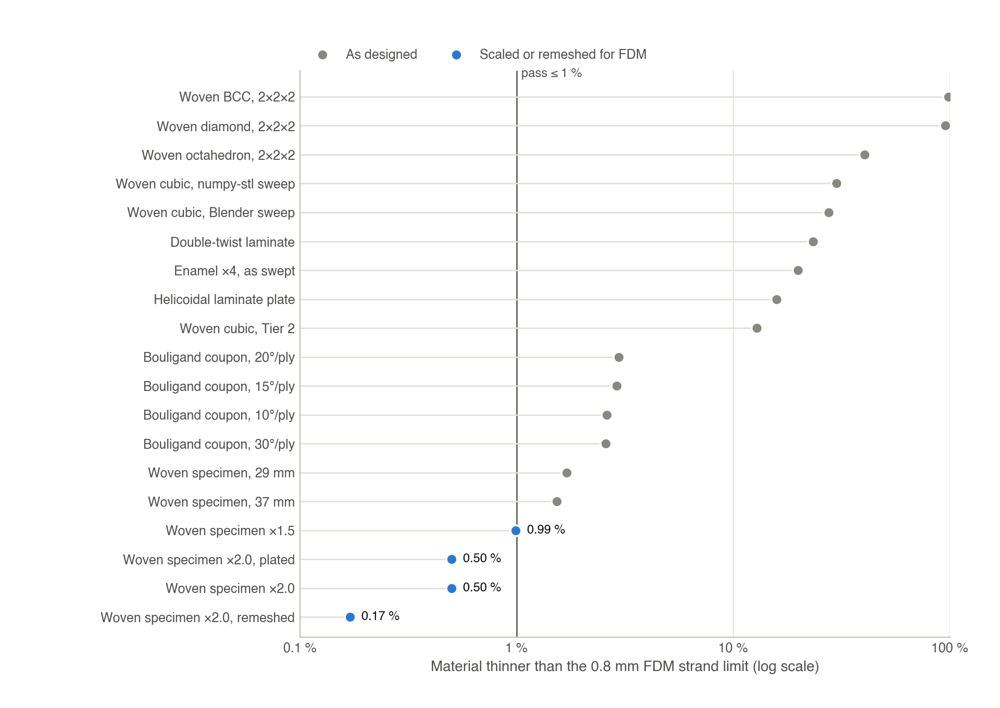
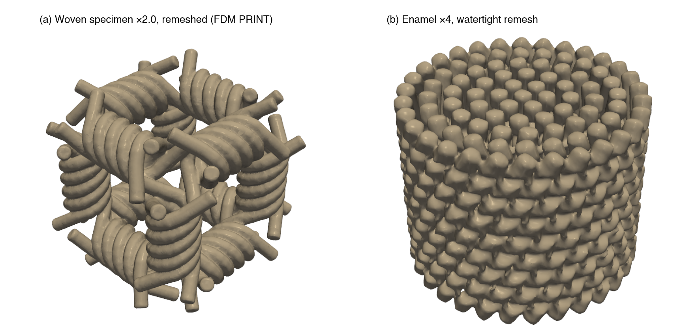

# Print audit and certification (test method TM-2)

A generated lattice is only useful if it prints. The print audit,
[`abcad/printing/print_audit.py`](../abcad/printing/print_audit.py), grades an STL against a
printer process profile and emits a verdict with concrete fixes (supports, drain holes, a uniform
scale factor, or redesign). It measures the properties that decide printability in a single
material: minimum wall and strut thickness against the process resolution, inter-fiber clearance
(unintended fusion destroys woven compliance), overhang and support burden, build-volume fit,
enclosed voids (trapped resin), and material volume. Definitions and acceptance criteria are
controlled in [ABCAD-QMS-002](qms/ABCAD-QMS-002_definitions_and_tests.pdf); the operating
procedure is [ABCAD-SOP-001](qms/ABCAD-SOP-001_loop_operation.pdf).

## 1. Method

**Surface checks (exact, on the triangulation).**

- Watertight: zero boundary edges. Manifold: zero non-manifold edges.
- Bounding box [mm], solid volume [mL] with a resin-mass estimate (1.10 g/mL), surface area, and
  triangle count.
- Overhang area fraction: faces whose outward normal points more than 45° downward, in the
  as-modeled orientation (+z up). Faces within 0.5 mm of the lowest point count as bed contact.

**Voxel checks.** The part is rasterized into an occupancy grid with the VTK image-stencil
voxelizer shared with the finite-element mesher, and Euclidean distance transforms (EDT) of the
solid and void phases are computed. The voxel size is chosen automatically as
max(0.12 mm, largest bounding-box dimension / 320), which keeps grids at or below about 33 million
voxels (about 0.7 GB peak with float64 EDTs); `--voxel` overrides it. Thickness and clearance
statements are trusted down to about two voxels at the reported voxel size.

- **Wall thickness by morphological opening.** Material "forms at diameter d" if it survives an
  erosion by d/2 followed by a dilation by d/2 (both computed as EDT thresholds in millimetres).
  The lost-material fraction lost@d is the fraction of the part that does not survive, i.e. the
  fraction thinner than d. A part forms at d when lost@d ≤ 1 %. Ladder: d ∈ {0.3, 0.5, 0.8,
  1.2} mm. The **maximum certified diameter** is the largest rung the part passes; it is the
  certified minimum feature size.
- **Clearance (fusion risk).** The local channel width of the void is twice its EDT, restricted to
  void within 3 mm of the structure. The fraction of near-structure void narrower than
  g ∈ {0.3, 0.5, 0.8} mm estimates where separate fibers will fuse (bead spread in FDM, cure bleed
  in resin).
- **Enclosed voids.** Void components with no path to the outside are counted and measured; they
  trap uncured resin and need drain holes.

**Caveats (repeated in every report).** Self-intersection is not tested, because woven fibers
intentionally interpenetrate at nodes and both slicer classes union overlapping shells; the voxel
occupancy already represents the printed solid. Overhang numbers apply to the as-modeled
orientation only. The minimum feature is a geometric statement; material and printer tuning shift
real-world limits.

## 2. Process profiles, verdicts, and acceptance

| Process | Minimum feature / strand | Overhang gate | Build volume [mm] |
|---|---|---|---|
| FDM, 0.4 mm nozzle (default) | ≥ 0.8 mm | ≤ 15 % of the surface area steeper than 45° | 220 × 220 × 250 |
| Resin (SLA/DLP) | ≥ 0.3 mm | handled by supports | 145 × 145 × 175 |

The process is selected with `--process fdm|resin|both`; inside the agentic loop it is read from
`ABCAD_PRINT_PROCESS` (default `fdm`), and the same limits drive both the loop's gate and the
audit.

| Verdict | Meaning |
|---|---|
| **PRINT** | No blocking issue. |
| **PRINT w/ fixes** | Printable after listed non-blocking remediations (supports, drain holes, reorientation). |
| **SCALE/REDESIGN** | A blocking violation, reported with computed advice (for thin features, the uniform scale factor). |

**TM-2 acceptance:** verdict PRINT; lost@0.8 mm ≤ 1 % for FDM; overhang ≤ 15 % for a support-free
claim; zero enclosed voids for a resin claim; the part fits the build volume.

**Auto-scale factor.** On a thin-feature failure the required uniform scale is arithmetic:
k = ⌈d_limit / d_certified⌉, rounded up to 0.1, with a sanity cap k ≤ 4 and a build-volume check.
The scaled variant is re-audited before it is recorded as printable. Uniform scaling preserves the
architecture exactly, so a linear finite-element result on the original (E_eff/E is
scale-invariant) remains valid for the scaled print.

## 3. Usage

```bash
# Audit one part for FDM (or --process resin | both); --voxel 0 selects the voxel size automatically
"$ABCAD_CAD_PYTHON" -m abcad.printing.print_audit --stl part.stl --process fdm \
    --out "$ABCAD_OUT/print_audit"

# Certify a chosen print candidate at a finer voxel
"$ABCAD_CAD_PYTHON" -m abcad.printing.print_audit --stl part.stl --process fdm --voxel 0.15

# Uniformly scaled variants (and a plated tension specimen) for FDM
"$ABCAD_CAD_PYTHON" -m abcad.printing.fdm_variants --stl part.stl --scales 1.5,2.0 \
    --plate 2.0 --overlap 0.8 --out "$ABCAD_OUT/print"

# Watertight solid remesh of an open-tube lattice (woven, enamel)
"$ABCAD_CAD_PYTHON" -m abcad.printing.remesh_watertight --stl part.stl --voxel 0.2 \
    --out "$ABCAD_OUT/print/part_smooth.stl"
```

Outputs: `print_audit.csv` (one row per part) and `print_audit_report.md` (per-part detail, fleet
verdict table, and method notes).

## 4. Repair routes

- **Uniform scaling** ([`abcad/printing/fdm_variants.py`](../abcad/printing/fdm_variants.py)).
  Each variant is scaled by k about (bounding-box center x, center y, z_min), so it stays centered
  and seated on the bed. With `--plate`, a plated tension specimen is also written: top and bottom
  grip plates as overlapping closed boxes whose inner faces sit `overlap` inside the fiber stubs,
  mirroring the finite-element plating convention (FEA.md §1). Plate thickness and overlap are
  given at ×1 scale and scale with the part; slicers union the overlapping shells into one bonded
  specimen. The same module provides a deterministic target-size normalization (largest bounding
  box dimension set to a requested value), which the loop applies when `ABCAD_TARGET_SIZE_MM` is
  set.
- **Watertight remesh** ([`abcad/printing/remesh_watertight.py`](../abcad/printing/remesh_watertight.py)).
  Open-tube swept lattices leave boundary edges at rod ends and show facets. The part is remeshed
  as solid geometry: fine voxelization, Gaussian smoothing of the occupancy field (σ = 0.9 voxel by
  default) to remove the staircase, a marching-cubes isosurface at 0.5, volume-preserving
  windowed-sinc (Taubin) smoothing, and topology-preserving decimation (60 % reduction by default).
  If decimation pinches thin bridges into non-manifold edges (dense lattices such as enamel), the
  undecimated isosurface is kept. The result is watertight and manifold by construction and
  preserves the geometry to within about half a voxel; certification remains the audit's job.

## 5. Results

Evidence: the `print_audit.csv` and `print_audit_report.md` records under `results/`, and the
agentic-loop run manifests.



*Figure 1. Fraction of each part's material thinner than the 0.8 mm FDM strand limit (lost@0.8,
logarithmic axis). As-designed parts fail the 1 % criterion; uniformly scaled and remeshed
variants of the 29 mm woven specimen pass. Values are listed in the tables below.*

### 5.1 As-designed fleet (FDM and resin)

| Part | Description | Bounding box [mm] | Volume [mL] | Overhang | lost@0.8 mm | FDM | Resin |
|---|---|---|---|---|---|---|---|
| `dt.stl` | Double-twist helicoidal laminate | 57 × 57 × 8 | 13.869 | 45 % | 23.4 % | SCALE/REDESIGN | PRINT w/ fixes (6 enclosed voids, 0.0 mL) |
| `h_solid.stl` | Helicoidal laminate plate | 56 × 56 × 7 | 12.672 | 45 % | 15.8 % | SCALE/REDESIGN | PRINT |
| `woven_bcc.stl` | Woven BCC, Tier 1, 2 × 2 × 2 | 86 × 86 × 86 | 3.740 | 15 % | 98.2 % | SCALE/REDESIGN | PRINT |
| `woven_cubic.stl` | Woven cubic, Tier 1, numpy-stl sweep | 96 × 96 × 96 | 5.123 | 13 % | 29.9 % | SCALE/REDESIGN | PRINT |
| `woven_cubic_blender.stl` | Woven cubic, Tier 1, Blender bevel sweep | 96 × 96 × 96 | 5.246 | 13 % | 27.5 % | SCALE/REDESIGN | PRINT |
| `woven_diamond.stl` | Woven diamond, Tier 1, 2 × 2 × 2 | 86 × 86 × 86 | 6.491 | 15 % | 95.0 % | SCALE/REDESIGN | PRINT |
| `woven_fea_small.stl` | 29 mm woven FEA specimen (24 fibers) | 29 × 29 × 29 | 3.893 | 14 % | 1.7 % | SCALE/REDESIGN | PRINT w/ fixes (728 enclosed voids, 0.002 mL) |
| `woven_fea_test.stl` | 37 mm woven FEA specimen | 37 × 37 × 37 | 4.993 | 14 % | 1.5 % | SCALE/REDESIGN | PRINT |
| `woven_octahedron.stl` | Woven octahedron, Tier 1, 2 × 2 × 2 | 91 × 92 × 92 | 5.655 | 15 % | 40.2 % | SCALE/REDESIGN | PRINT |
| `ws.stl` | Woven cubic, Tier 2 defaults | 91 × 91 × 91 | 8.248 | 13 % | 12.8 % | SCALE/REDESIGN | PRINT |

All ten parts are watertight and manifold. Every part is resin-printable (eight PRINT, two PRINT
w/ fixes for enclosed micro-voids) and none is FDM-printable as designed: between 1.5 % and 98 % of
the material is thinner than the 0.8 mm strand limit, and the two laminate plates also exceed the
overhang gate. Thin features are therefore the dominant FDM failure mode, which is why the loop
runs this audit on every approved design (Section 6).

### 5.2 FDM variants of the 29 mm woven specimen

| Variant | Bounding box [mm] | Volume [mL] | Overhang | lost@0.8 mm | FDM verdict |
|---|---|---|---|---|---|
| ×1.5 | 43.7 × 43.7 × 43.7 | 13.138 | 14.2 % | 0.99 % | PRINT (marginal) |
| ×2.0 | 58.2 × 58.2 × 58.2 | 31.142 | 14.2 % | 0.50 % | PRINT |
| ×2.0, plated tension specimen | 58.2 × 58.2 × 63.0 | 58.278 | 16.7 % | 0.50 % | PRINT w/ fixes (top-plate underside needs bridging or supports) |
| **×2.0, remeshed (release candidate)** | 57.7 × 57.7 × 57.7 | 31.047 | 13.4 % | **0.17 %** | **PRINT** |

The release candidate `woven_fea_small_x20_smooth.stl` was produced by voxel remeshing (0.25 mm)
and windowed-sinc smoothing of the ×2.0 variant: 555,622 triangles, watertight, zero non-manifold
edges, maximum certified diameter 1.2 mm, zero enclosed voids, and 11 % of near-structure gaps
below 0.8 mm (expected local fusion at fiber crossings). It is support-free in the as-modeled
orientation.



*Figure 2. Watertight print meshes. (a) The certified release candidate: 29 mm woven specimen
scaled ×2.0 and remeshed (57.7 mm cube, FDM PRINT). (b) The ×4 linear-twist enamel lattice
remeshed as a watertight solid (1,022,332 triangles; certification pending).*

### 5.3 Bouligand pitch coupons (cylindrical fibers, Δθ = 10/15/20/30° per ply)

All four coupons (about 36 × 36 × 23 mm, 9.09 mL) are watertight but receive SCALE/REDESIGN for
FDM: the overhang area is 22.4 % and 2.6–3.0 % of the material is thinner than 0.8 mm. The overhang
is inherent to the geometry class — the underside of every horizontal Ø 2 mm fiber counts as
steeper than 45° although the actual bridges between fibers are 1.2 mm micro-spans, and no scale
factor changes an area fraction. The thin material is the weld necks between plies, and the
enclosed micro-voids sit along weld lines (irrelevant for FDM). Two of the coupons (10° and 30°)
are designated a documented concession trial: printing them calibrates the overhang threshold for
cylinder-class geometry.

### 5.4 Enamel lattice

The ×4 linear-twist lattice as swept (25.95 × 26.0 × 21.06 mm, 7.197 mL, overhang 6.9 %) is not
watertight — rods and bridges are open, coexisting tube shells — so it is rejected (SCALE/REDESIGN:
repair the open surface; 19.8 % of the material is thinner than 0.8 mm; 60 % of near-structure
gaps are below 0.8 mm because adjacent rods nearly touch). The watertight remesh of Figure 2b is the
enamel print path; its audit is the next certification step.

### 5.5 Loop-produced artifact

In a converged agentic run on the prompt "a woven cubic lattice metamaterial", the approved design
(a 90.6 mm cube) failed the print gate honestly: 13.7 % of its material was thinner than 0.8 mm
(maximum certified diameter 0.5 mm). The gate generated a uniformly scaled ×1.6 variant, which
re-audited as PRINT with a maximum certified diameter of 0.8 mm; both files and both verdicts are
recorded in the run manifest ([WORKFLOWS.md, Figure 1](WORKFLOWS.md#0-the-build-loop)).

## 6. Integration with the agentic loop

- **In-loop gate.** After every render the Blender validation step reports mesh statistics; the
  manufacturability gate checks the world bounding box against the build volume and the 45° / 15 %
  overhang rule.
- **Deep print gate.** After the critic approves a design, the full audit runs once on the
  actually exported STL (never inside the repair loop), and its verdict is merged into the
  manufacturability record.
- **Deterministic repair.** A thin-feature-only failure is repaired by uniform scaling with the
  computed k, not by asking a language model to thicken fibers: scaling preserves the architecture,
  whereas a free-form edit changes it. The scaled variant is re-audited.
- **Records.** Verdicts, issues, recommendations, and the scaled variant are written to the run
  manifest.

## 7. Certified print files and print cards

| File | Process | Verdict | Notes |
|---|---|---|---|
| `woven_fea_small_x20_smooth.stl` | FDM | PRINT (release candidate) | 57.7 mm cube, 31.0 mL (≈ 38 g PLA); no supports; 8 mm brim; estimated 6–9 h |
| `woven_fea_small_x20.stl` | FDM | PRINT | Superseded for release by the remeshed file; kept as lineage |
| `woven_fea_small_x15.stl` | FDM | PRINT (marginal) | lost@0.8 mm = 0.99 % |
| `woven_fea_small_x20_plated.stl` | FDM | PRINT w/ fixes | 58 × 58 × 63 mm, 58.3 mL (≈ 72 g PLA); estimated 12–16 h; bridge the top-plate underside (bridge fan 100 %, 20 mm/s, 90 % flow) or add supports (everywhere, 8–10 % density, 0.24 mm Z distance) |
| `bouligand_d10_w.stl`, `bouligand_d30_w.stl` | FDM | Concession trial | ≈ 11 g each; no supports; 8 mm brim; underside sag on fiber rows is expected |
| Loop artifact, auto-scaled ×1.6 | FDM | PRINT | The first certified artifact produced end to end by the loop |

STL files are regenerable artifacts and are not stored in the repository; their audit records are.
The `woven_fea_small` lineage starts from a 29 mm woven specimen of 24 fibers (27,072 triangles)
whose STL is the reference input for the variants above. The reference slicer profile used for
these cards is given in [WORKFLOWS.md §5A](WORKFLOWS.md#5a-pla--petg-rigid-fdm). After each print,
the part, date, filament, deviations from the card, visible defects, and measured mass are
recorded, so that measured versus predicted mass calibrates the audit.
