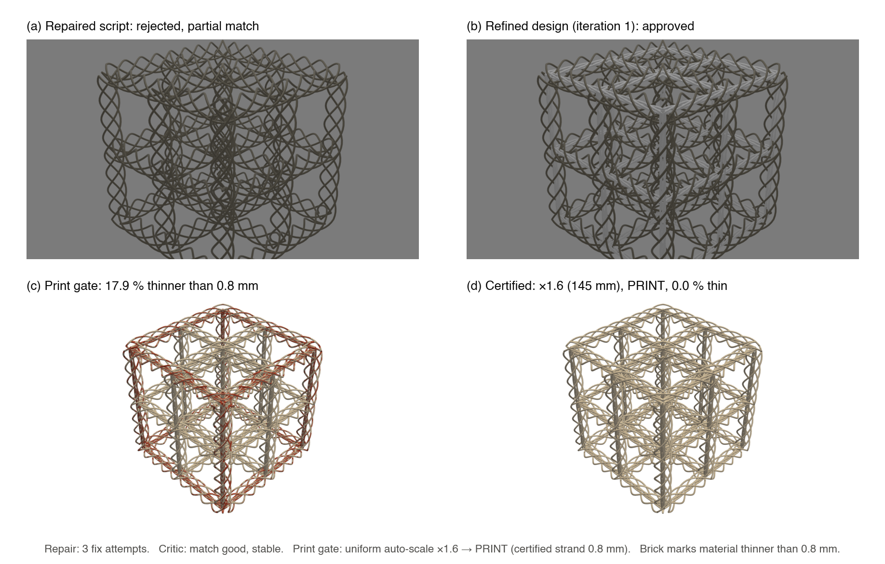

# Build workflows

This runbook takes each structure in scope from a request (a natural-language prompt or an explicit
parameter set) to a printed, single-material part: generation, rendering and critique,
manufacturability gating, STL certification, slicing, printing, and inspection. Every structure has
a card with its prompt, generator command, parameters, single-material strategy, material, slicer
settings, supports, and acceptance test. Generator parameters are defined in
[GENERATORS.md](GENERATORS.md), the print audit in [PRINTING.md](PRINTING.md), and the optional
mechanical verification in [FEA.md](FEA.md) and [FRACTURE.md](FRACTURE.md). The controlled
operating procedure is [ABCAD-SOP-001](qms/ABCAD-SOP-001_loop_operation.pdf).

Commands use environment variables instead of machine paths: `ABCAD_BLENDER` (Blender
executable), `ABCAD_CAD_PYTHON` (CAD-environment interpreter), `ABCAD_SFEPY_PYTHON`
(SfePy-environment interpreter), `ABCAD_MOOSE_EXEC` (MOOSE application), and `ABCAD_OUT` (output
directory). The conda environments are pinned in `env/*.lock.yml`. The repository's `justfile`
wraps the commands below (`just --list`): `helicoidal`, `woven`, `woven-simple`, `enamel`,
`audit`, `fdm-variants`, `remesh`, `mesh`, `tension`, `tension-finite`, `rank`, `fracture`, and
the fracture-deck generators.

---

## 0. The build loop

```
natural-language prompt
  -> LoRA code emitter          fine-tuned Llama-3.2-3B, emits Blender-Python; runs in a child
                                process that exits before any critic model loads
  -> headless Blender render    executes the code, renders a PNG, reports mesh statistics,
                                exports the geometry to STL
  -> VLM critic                 local vision-language model compares the render with retrieved
                                reference renders; returns a schema-constrained verdict
  -> repair / refine            code fixer on execution errors; code designer on a critique
  -> manufacturability gate     bounding box and 45-degree overhang; then the full print audit on
                                the exported STL; deterministic uniform auto-scale on a
                                thin-feature failure; re-audit
  -> certified STL + run manifest
  -> slice -> print -> inspect
```

The loop runs entirely on local hardware: the code emitter and embedding model in PyTorch, the
critic and repair models through Ollama, geometry in Blender, and the audit in Python. Its
internals (graph, prompts, guards) are documented with the agent in `abcad/agent/`. Each run
writes a `run_manifest.json` with the prompt, the critic verdict, the manufacturability verdict
(including any auto-scaled variant), the artifact paths, and the iteration and repair counters.



*Figure 1. A certified run from the live validation of 2026-09-26, on the prompt "a woven cubic
lattice metamaterial", starting from a recorded emit that fails to execute. The code fixer repaired
it in three attempts. (a) The critic rejected the repaired lattice as a partial match ("lacks
explicit helical fiber winding on cube edges"). (b) The code designer's first iteration added
wound fibers along the cube edges and was approved (match good, stability stable). (c) The print
gate's deep audit found 17.9 % of the material thinner than the 0.8 mm FDM strand (brick). (d) A
uniform ×1.6 variant (145 mm) removes every thin feature and is certified PRINT. Panels (a) and (b)
are the loop's own renders, as the critic saw them; (c) and (d) are recomputed with the audit's
measure. The run took 8.2 minutes ([PERF.md](PERF.md)); all five validation runs are in
[the validation record](../results/agent_runs/validation_2026-09-26/E2E_REPORT.md).*

There are three ways to drive the pipeline:

- **Agentic.** A design phrase ("a woven cubic lattice metamaterial") goes through the full loop;
  the terminal artifact is an STL whose print verdict is recorded in the manifest.
- **Deterministic.** A generator is called directly with explicit parameters. This is the
  recommended route for fabrication coupons and for any specimen that will be compared with a
  simulation, because the dimensions are exact and reproducible.
- **Verification only.** The print audit, the FEA instruments, and the fracture decks accept any
  STL or parameter set, whichever route produced it.

**Single-material rule.** One filament or one resin per build; all function comes from geometry.

---

## 1. Build matrix

| Structure | Family | Inspiration | Generator settings (recommended) | Material | Supports |
|---|---|---|---|---|---|
| Bouligand, constant pitch | Helicoidal | Mantis-shrimp dactyl club | `--progression constant --delta 10 --plies 36 --ply_thickness 0.2 --plate_size 40` | PLA | Minimal |
| Bouligand, graded pitch | Helicoidal | Dactyl-club gradient | `--progression graded --delta_min 3 --delta_max 18 --plies 30` | PLA, PETG | Minimal |
| Bouligand, exponential | Helicoidal | — | `--progression exponential --delta 4 --ratio 1.10 --plies 30` | PLA | Minimal |
| Bouligand, Fibonacci | Helicoidal | — | `--progression fibonacci --delta 5 --plies 16` | PLA | Minimal |
| Double twist | Helicoidal | Coelacanth scale | `--progression double_twist --delta_a 10 --delta_b 5 --plies 40` | PLA, resin | Some |
| Herringbone | Helicoidal | — | `--progression herringbone --delta 10 --flip_every 6 --plies 36` | PLA | Minimal |
| Woven cubic (n = 4) | Woven, Tier 1 | Woven metamaterials | `--topology cubic --cells 2 2 2 --unitcell 40 --reff_over_L 0.111 --nrev 1.0 --fiber_radius 0.4` | TPU, resin | Yes |
| Woven BCC (n = 3) | Woven, Tier 1 | Woven metamaterials | `--topology bcc --reff_over_L 0.111 --nrev 1.333 --fiber_radius 0.4` | TPU, resin | Yes |
| Woven octahedron (n = 3) | Woven, Tier 1 | Woven metamaterials | `--topology octahedron --reff_over_L 0.111 --nrev 1.333` | TPU, resin | Yes |
| Woven diamond (n = 3) | Woven, Tier 1 | Woven metamaterials | `--topology diamond --cells 3 2 1 --reff_over_L 0.111 --nrev 0.75` to `1.333` | TPU, resin | Yes |
| Woven, graded | Woven, Tier 1 | Functional gradient | `--grade linear --grade_axis 2 --reff_bot 0.071 --reff_top 0.125` | Resin | Yes |
| Enamel decussation | Enamel | Decussated tooth enamel | `--twist_type linear` (or `accelerating`, `sigmoid`) `--scale 4` | PLA | None expected |

R_eff/U ≈ 1/9 is `--reff_over_L 0.111`; n_rev = 4/3 is `--nrev 1.333`.

---

## 2. Helicoidal workflows

All helicoidal cards share the following: the laminate is built with
`abcad/generators/helicoidal.py`; weak planes are modeled (`--interface groove` by default, or the
inter-fiber gaps of a fiber style); the ply thickness equals the print layer height; the footprint
is 20–60 mm; grooved and gapped plies remain one connected solid; and the stack is printed flat,
with the stacking axis along the build direction, so that each ply is one set of layers. PLA is
recommended for fast iteration and resin for fine pitch.

### 2A. Bouligand, constant pitch (baseline)

- **Prompt:** "a helical Bouligand structure with constant 10° rotation per ply, 36 plies".
- **Build:**
  ```bash
  "$ABCAD_BLENDER" -b -P abcad/generators/helicoidal.py -- --progression constant --delta 10 \
      --plies 36 --ply_thickness 0.2 --plate_size 40 --interface groove \
      --export_stl --stl_path "$ABCAD_OUT/bouligand_constant.stl"
  ```
  n = 18 plies per 180°, two full pitches (0 → 360°), stack height 7.2 mm.
- **Single-material strategy:** a groove along θ_k at every interface guides the crack onto the
  rotating weak plane.
- **Print:** PLA, 0.2 mm layers, 3 walls, solid infill for fracture coupons, brim. Rotated full
  plates are nearly self-supporting; corners overhang slightly.
- **Acceptance:** runs headless and renders; watertight STL; prints as one piece; the helicoidal
  groove staircase is visible.

### 2B. Bouligand, graded pitch

- **Prompt:** "a graded helical Bouligand structure, small pitch angle at the bottom increasing
  toward the top".
- **Build:** `--progression graded --delta_min 3 --delta_max 18 --plies 30 --ply_thickness 0.2`.
- **Print:** as 2A (PLA or PETG). **Acceptance:** as 2A; the increment visibly grows with height.

### 2C. Bouligand, exponential pitch

- **Prompt:** "a helical Bouligand structure with exponentially increasing rotation per ply".
- **Build:** `--progression exponential --delta 4 --ratio 1.10 --plies 30`
  (θ_k = Δθ·(r^k − 1)/(r − 1)).
- **Print and acceptance:** as 2A.

### 2D. Bouligand, Fibonacci

- **Prompt:** "a Fibonacci helical Bouligand structure".
- **Build:** `--progression fibonacci --delta 5 --plies 16` (increments 1, 1, 2, 3, 5, 8, … × 5°).
- **Print and acceptance:** as 2A.

### 2E. Double twist

- **Inspiration:** the coelacanth-scale double helicoid, the toughest reported helicoidal variant
  (+122.5 % specific energy absorption over a single helicoid in a multi-material composite; a
  single material is expected to recover only a fraction).
- **Prompt:** "a double-twist helical Bouligand structure with two interleaved helicoids".
- **Build:** `--progression double_twist --delta_a 10 --delta_b 5 --plies 40 --ply_thickness 0.2`
  (or the 30/15/10/5° schedule).
- **Single-material strategy:** a denser set of interfaces gives finer weak planes and stronger
  twisting; use resin below 0.15 mm ply thickness.
- **Print:** PLA at 0.2 mm or resin at 0.05 mm; some supports if the interleaving creates overhangs.

### 2F. Herringbone (chevron Bouligand)

- **Prompt:** "a herringbone Bouligand structure with alternating twist direction every 6 plies".
- **Build:** `--progression herringbone --delta 10 --flip_every 6 --plies 36`.
- **Acceptance:** as 2A; the sign flips are visible in the render.

### 2G. Fiber-style variants (any helicoidal card)

- `--fiber_style rect_fibers` or `--fiber_style cyl_fibers`: each ply is a row of fibers along its
  director; the inter-fiber gaps are the weak planes (the most literal fiber Bouligand).
- **Prompt:** "a helical Bouligand structure made of cylindrical fibers, 10° per ply".
- **Print:** fiber Ø ≥ 0.8 mm for FDM, otherwise resin. For finite-element coupons, crossing fibers
  must interpenetrate by at least 0.4 mm so that the plies weld in the voxel mesh (FEA.md, coupon
  design rules).

---

## 3. Woven workflows

All woven cards share the following: the lattice is built with
`abcad/generators/woven/build.py` (Tier 1; the Blender-free `all_np` stage is shown), scaled for
printing (fiber Ø 0.6–1.0 mm, U = 30–60 mm), checked for inter-fiber clearance (at least one fiber
diameter), and exported to STL. TPU shows the stretch and compliance; resin resolves the finest
features. Supports are required (breakaway lattice or a thin sacrificial scaffold), and the part is
oriented to minimize the worst helix overhang.

### 3A. Woven cubic (n = 4)

- **Prompt:** "a woven cubic lattice metamaterial with 4-fiber beams".
- **Build:**
  ```bash
  "$ABCAD_CAD_PYTHON" -m abcad.generators.woven.build --stage all_np --topology cubic \
      --cells 2 2 2 --unitcell 40 --reff_over_L 0.111 --nrev 1.0 --fiber_radius 0.4 \
      --stl "$ABCAD_OUT/woven_cubic.stl" --png "$ABCAD_OUT/woven_cubic.png"
  ```
- **Single-material strategy:** entanglement and fiber straightening provide compliance and
  toughness in one material; fused fibers destroy it (FEA.md §4).
- **Print:** TPU at 0.2–0.3 mm layers and 25 mm/s with direct drive, low retraction, and breakaway
  supports; or resin at 0.05 mm with light supports.
- **Acceptance:** the clearance check passes; the tessellation prints without fiber fusion.

### 3B. Woven BCC (n = 3)

- **Prompt:** "a woven body-centered-cubic lattice".
- **Build:** `--topology bcc --cells 2 2 2 --unitcell 40 --reff_over_L 0.111 --nrev 1.333
  --fiber_radius 0.4`. BCC is the stiffness-tuning demonstration of the woven literature
  (40 → 160 kPa as R_eff falls from 6 to 2 µm).

### 3C. Woven octahedron (n = 3)

- **Prompt:** "a woven octahedral lattice".
- **Build:** `--topology octahedron --unitcell 40 --reff_over_L 0.111 --nrev 1.333 --fiber_radius 0.4`.

### 3D. Woven diamond (n = 3)

- **Prompt:** "a woven diamond lattice".
- **Build:** `--topology diamond --cells 3 2 1 --unitcell 40 --reff_over_L 0.111 --nrev 0.75`
  (up to 1.333) `--fiber_radius 0.4`.

### 3E. Functionally graded woven lattice

- **Prompt:** "a functionally graded woven lattice, stiff at the base and compliant at the top".
- **Build:** `--topology cubic --grade linear --grade_axis 2 --reff_bot 0.071 --reff_top 0.125`.
  A smaller bundle radius is stiffer, so R_eff/U ramps from about 1/14 at the base to 1/8 at the
  top; dissimilar cells mate automatically (node resizing and the fiber-matching shift).
- **Print:** resin for the fine compliant cells, or TPU.
- **Acceptance:** the clearance check passes across the whole gradient and the render shows the
  change in R_eff.

### 3F. Woven, Tier 2 (compact, language-model-emittable)

```bash
"$ABCAD_BLENDER" -b -P abcad/generators/woven/woven_simple.py -- --topology cubic --cells 2 2 2 \
    --unitcell 40 --reff_over_L 0.12 --nrev 1.0 --fiber_radius 0.5 \
    --export_stl --stl_path "$ABCAD_OUT/woven_simple.stl"
```

The simplified node model is intended for generation and quick prints; Tier 1 is the
high-fidelity path.

---

## 4. Enamel decussation workflow

- **Route:** deterministic. The enamel family is not yet represented in the retrieval corpus of
  the agentic loop, so the generator is called directly.
- **Build (×4 scale, Ø 2 mm rods):**
  ```bash
  "$ABCAD_CAD_PYTHON" -m abcad.generators.enamel --twist_type linear --scale 4 \
      --stl "$ABCAD_OUT/enamel_linear_x4.stl"
  ```
- **Watertight print mesh:** the swept rods and bridges are coexisting open shells, so the print
  file is remeshed as a solid:
  ```bash
  "$ABCAD_CAD_PYTHON" -m abcad.printing.remesh_watertight --stl "$ABCAD_OUT/enamel_linear_x4.stl" \
      --voxel 0.2 --out "$ABCAD_OUT/enamel_linear_x4_smooth.stl"
  ```
- **Single-material strategy:** the rods and bridges are one material; toughening comes from the
  crack twisting through alternating-sign rod rings (FRACTURE.md).
- **Print:** PLA with the reference profile of §5A; the modeled overhang area is 6.9 %, below the
  15 % support-free limit.
- **Acceptance:** certify the remeshed file with the print audit (PRINTING.md). The narrow gaps
  between near-touching rods are expected to fuse locally in FDM.

---

## 5. Material workflows

Choose one material per build: TPU for woven lattices; PLA or PETG for helicoidal and enamel
coupons; resin for fine woven lattices, fine-pitch helicoids, and small features. The profiles
below are starting points.

### 5A. PLA / PETG (rigid FDM)

- Nozzle 0.4 mm; layer height equal to the helicoidal ply thickness (0.2 mm typical); 3
  perimeters; 15–20 % infill for display parts, **100 % infill for specimens that are compared with
  FEA** (the simulations assume solid members).
- PLA: nozzle 200–210 °C, bed 60 °C. PETG: nozzle 235–245 °C, bed 80 °C. Brim on.
- **Reference profile of the first prototype batch** (PLA, Bowden extruder, 220 × 220 × 250 mm
  bed): 0.2 mm layers with 0.4 mm lines; 3 walls (1.2 mm); 4 top and bottom layers; 100 % infill;
  nozzle 205 °C and bed 60 °C on glass; 45 mm/s (outer walls 25 mm/s, first layer 20 mm/s); fan
  100 % from layer 3 with a 10 s minimum layer time; retraction 5.0 mm at 45 mm/s with combing
  within infill; random Z seam; 8 mm brim; supports off unless the audit requires them.
- Orientation: stacking axis along the build direction. Post-processing: remove brim and supports;
  inspect the groove staircase.

### 5B. TPU (flexible FDM) — woven lattices

- Direct-drive extruder; 0.2–0.3 mm layers; 20–30 mm/s; low or zero retraction; nozzle 220–235 °C;
  bed 40–50 °C; tune cooling to limit stringing; breakaway supports (same TPU) under helix arcs.
- Orient to minimize unsupported near-horizontal helix segments; remove supports from between the
  fibers without fusing them. TPU is chosen to demonstrate stretch and compliance.

### 5C. Resin (SLA, DLP, LCD) — fine woven lattices, smooth helicoids

- Layers 0.025–0.05 mm; standard or tough resin; light, low-density auto-generated supports on
  helix and woven undersides.
- Tilt to reduce suction and overhang, and check drainage of enclosed voids (the audit reports
  them). Post-processing: IPA wash, remove supports while green, UV cure.

### 5D. Raster-angle toughening (optional, not automated)

For bead-anisotropy toughening closer to the printed-Bouligand literature, print a solid block and
rotate the per-layer infill (raster) angle by Δθ per layer group. Most slicers do not expose
per-layer raster rotation, so this requires slicing in segments with incrementing infill angles, a
G-code post-processor, or a slicer scripting API.

---

## 6. Order of operations for a new structure

1. **Build** the geometry with its generator (or through the loop) and render it.
2. **Audit** the STL for the target process (PRINTING.md). On a thin-feature failure, create a
   uniformly scaled variant (`abcad/printing/fdm_variants.py`) and re-audit; on an open or
   non-manifold surface, remesh it (`abcad/printing/remesh_watertight.py`).
3. **Verify mechanically if the design intent requires it:** linear stiffness and flaw tolerance
   with the voxel-hex FEA (FEA.md); crack twisting and deflection with the phase-field decks
   (FRACTURE.md). Uniform scaling preserves E_eff/E, so FEA on the unscaled design remains valid
   for the scaled print.
4. **Slice** with the material profile of §5, review the preview at the first fiber-crossing
   height, and **print**.
5. **Inspect** against the checklist below and record the outcome with the run's evidence.

---

## 7. Per-build acceptance checklist

- [ ] The script executes headless without error and leaves at least one MESH object.
- [ ] A render exists; the critic returned match = good and stability = stable (loop builds).
- [ ] The exported STL is watertight and manifold (print audit surface checks).
- [ ] Manufacturability: lost-material fraction at the process limit ≤ 1 %; overhang ≤ 15 % or a
      documented supports plan; the part fits the build volume; woven inter-fiber clearance ≥ one
      fiber diameter.
- [ ] Single material: one filament or resin; weak planes (helicoidal, enamel) or entanglement
      (woven) preserved.
- [ ] Sliced with the matching material profile; supports appropriate.
- [ ] Printed; supports removed without fusing fibers or plies; mass within ±15 % of the audited
      volume × density; bounding box within ±0.5 mm of the STL.
- [ ] Optional mechanical check (notched bend for helicoidal and enamel coupons; stretch or
      compression for woven lattices).
